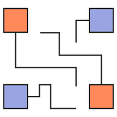
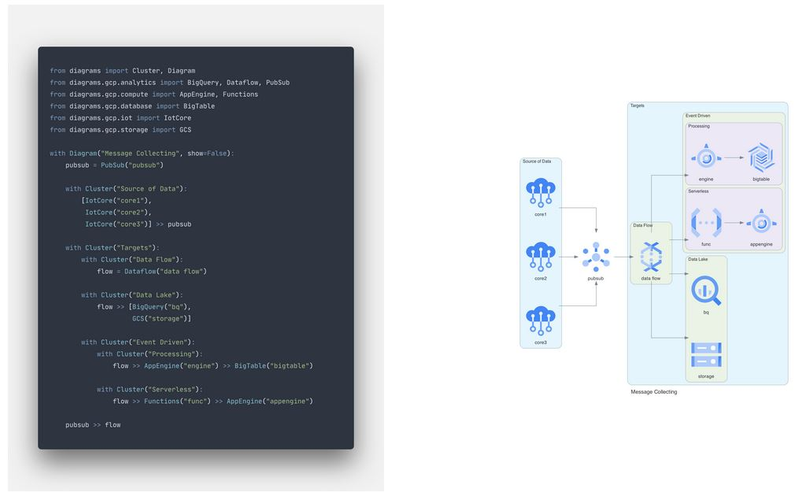

Title: Générer ses diagrammes avec Python
Category: Informatique
Tags: python, autohébergement, web, diagramme
Date: 2023-08-23
Status: published

Dans cet article, nous allons nous initier au DaC afin de réaliser de magnifiques schémas en Python.

Aujourd'hui, il est assez tentant de s'orienter vers des solutions comme Draw.io pour réaliser des schémas visuellement agréable, mais l'outil en lui-même ne me convient pas, car je ne le trouve pas assez flexible. Je souhaite utiliser un outil libre sans restriction et qui permet de générer confortablement (voir automatiquement) des beaux schémas que je peux exporter en SVG et PDF à la demande.



# Pourquoi utiliser du DaC ? 🤔

Pour l'évolution des schémas dans le temps, il devient alors très usant de ressortir son logiciel pour éditer proprement pour une simple mise à jour.

En tant que Graphiste, il m'est difficile de ne pas être perfectionniste et la moindre mise à jour prend alors beaucoup trop de temps pour avoir un rendu satisfaisant.
Changer de logique pour le DaC permet donc de ne plus du tout sortir de logiciel de PAO, mais de simplement tout coder. En plus d'être une solution légère, il est alors agréable de revenir dans le code pour actualiser son schéma. Couplé avec du versionnage, c'est encore plus plaisant à maintenir.

# Recherche d'outil 🔍

J'ai mis du temps à trouver mon bonheur, entre les vieux projets dépréciés de geek frustrés difficile à exploiter, puis je suis tombé sur la référence, à savoir [Kroki.io](https://kroki.io) qui convient à beaucoup, car bien maintenu et dispose de tout un tas de librairie populaire ... mais c'est tout ! Très efficace pour générer automatiquement des diagrammes, il n'offre cependant pas la flexibilité pour réaliser l'effet visuel "wahou" que je cherche ni la simplicité.

J'ai bien évidement trouvé la pépite, c'est pour ça que je fait cette note 😜.
Voici donc comment prendre en main [DIAGRAMS](https://diagrams.mingrammer.com/) de Mingrammer.

# Fonctionnement de Diagrams ⚙️


Le principe d'utilisation est au plus efficace, le schéma est sous forme d'un fichier Python (.py) :

```python
from diagrams import Diagram
from diagrams.aws.compute import EC2

with Diagram("Simple Diagram"):
    EC2("web")
```
Il permet de générer le rendu d'une simple commande :

```bash
python3 diagram.py
```

Et paf, nous voici avec une image !

Voici un exemple un peu plus complexe :




# Installation 🔧

En utilisant son gestionnaire de paquet préféré pour déployer Python, Pip, Graphiz et Inkscape (sera utile pour la suite), par exemple sur une base RHEL :

```bash
dnf install python3 python3-pip graphviz inkscape
pip3 install diagrams
```

Terminé, aller bisous à la famille, n'oublie pas de nourrir le chien, ciao. J'aime bien ça moi, quand ça ne réclame pas la mise en place d'une usine à gaz ✌️

Il est possible de l'installer sur d'autres OS comme Windows et MacOS si besoin.

Pour son utilisation avancée, l'outil est très bien documenté et vous fournit pas mal d'exemple et surtout un guide pour vous expliquer les 3 grands principes, qu'il faut interpréter sur votre schéma ainsi :

- Nodes : Enssemble de ressources importés
- Clusters : Groupe d'éléments
- Edges : Les liaisons entre les éléments

Ce qui est pratique avec les Nodes, c'est qu'ils sont basé sur des technologies existantes populaires (AWS, Azure, etc ...) pour un joli rendu immédiat.

<i class="fa fa-book"></i> [consulter la documentation](https://diagrams.mingrammer.com/docs/getting-started/installation).

# Utilisation de ses propres icones 😍

Voici le point le plus intéressant, utiliser ses propres icônes pour un maximum de flexibilité avec le Node **Custom**.

Si vous êtes à la recherche d'un pack d'icônes SVG pour réaliser un schéma réseau, vous pouvez tous simplement récupérer ceux de Microsoft Azure qui sont très cool en clonant simplement ce dépôt :

```bash
git clone https://github.com/benc-uk/icon-collection.git
```

Grâce à Inkscape, vous pouvez convertir les images directement dans une taille et format exploitable pour Diagrams pour un rendu de qualité, par exemple :

```bash
inkscape -w 1024 -h 1024 icon-collection/azure-patterns/server.svg -o icons/server.png
```

Maintenant, que nos icônes sont prêtes et stockés dans un dossier ("icons" dans mon cas), il ne reste plus qu'à invoquer tout ça dans son script.

# Mise en application 👷

Voici maintenant comment initier un script Python avec icônes personnalisées (et ma configuration maison en bonus) :

```bash
# Importation des dépendances
from diagrams import Diagram, Cluster, Edge
from diagrams.custom import Custom
from datetime import datetime
today = datetime.today()

# Ici la configuration :
# Le titre du schéma avec la date de génération,
# le nom de fichier de sortie avec les formats à générer,
# la direction d'affichage
# https://www.graphviz.org/documentation
with Diagram("Mon schéma - %s" % today.strftime('%d/%m/%Y %H:%M') , show=False, filename="schema", outformat=["png", "jpg", "svg", "pdf", "dot"], direction="TB"):

  # Icones personalisés
  internet = Custom("Serveur", "icons/server.png")

  # Groupes
  with Cluster("Zone LAN \n VLAN 1 \n DHCP : 192.168.1.1-99"):
  	HOME = Custom("192.168.1.0/24", "icons/server.png")

  with Cluster("Zone DMZ \n VLAN 100 \n DHCP : 192.168.100.1-99"):
    DMZ = Custom("192.168.100.0/24", "icons/server.png")

  # Liens
  internet >> Edge(color="red", label="FTTH", style="bold") >> DMZ
```

Voici pour le concret, je vous invite à voir le schéma complet que je partage de mon propre réseau domestique à l'adresse [<i class="fa fa-map"></i> network.heuzef.com](https:/network.heuzef.com).
Le code Python de mon schéma y est disponible au téléchargement pour vous aider à apprivoiser l'outil.

*[DaC]: Diagrams as Code
