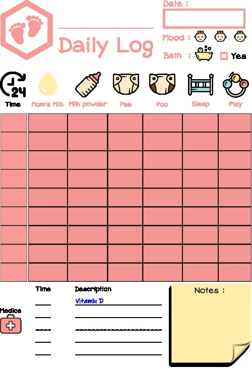

Title: Guide 2023 du nouveau papa
Category: Parentalité
Tags: bébé, astuce, maternité, ressources, astuce, emploi
Date: 2023-07-28
Status: published

Je suis un heureux papa depuis le début de l'année 2023, comblé par l'arrivée de ma merveilleuse petite fille 👶. Comme tout nouveau papa un peu anxieux, je me suis lancé dans une quête de connaissance. J'avais d'abord prévu de partir quelques semaines voir un vieux sur une montagne pour avoir des réponses sur le sens de la vie ... mais je me suis retrouvé submergé par une multitude de blogs féministes qui débordent de conseils banals et de codes promo pour acheter toutes sortes de gadgets inutiles.

Toi, futur nouveau papa, qui viens de tomber sur cette note, prends une bière et ne cherche pas plus loin la sagesse. Je vais t'éclairer avec ce mini-guide de l'année 2023.

## L'époque et la culture ⏳

Si je précise l'année 2023, c'est parce qu'avec le recul, je me rends compte que toutes les informations superflues que j'ai trouvées ont mal vieilli. Car le constat est simple : la naissance d'un bébé et la parentalité suivent toujours la même logique biologique. Il n'y aura pas de mutation soudaine qui rendra votre bébé différent des autres, idem pour les parents. Vous pouvez donc commencer par faire le tri et ne tenir compte que de tout ce qui est intemporel en ce qui concerne l'essentiel.

Pour le reste, il est important de s'adapter à notre époque, mais il faut faire la part des choses et ne pas stresser si vous n'êtes pas dans une maternité de niveau 10000, si l'échographie est floue et montre des choses "bizarres" ou encore si telle marque est meilleure que telle autre, ...

J'ai la chance incroyable que ma fille soit métisse franco-chinoise, ce qui m'a exposé à une partie de la culture chinoise sur la naissance, pour le meilleur comme pour le pire. Le gros avantage est que j'ai pu confronter la culture française et chinoise pour ne garder que le meilleur en ce qui concerne la natalité et ainsi mettre en évidence les différences. Certaines choses recommandées et admises en France peuvent paraître aberrantes en Chine et vice-versa.

Je compte conserver cette approche d'interculturalité tout au long de ma vie de père, car je suis persuadé que cela offre un précieux recul (avis partagé par certaines de mes connaissances dans le même contexte que le mien).

## La base : deux bouquins 📚

Pour commencer, les bons livres ne manquent pas et vous apporteront une mine d'informations détaillées. Je vous recommande vivement un livre pour les papas et un livre pour les mamans, car l'approche psychologique et stratégique est vraiment différente :

* Le livre pour les papas sera généralement plus court et plus centré sur des aspects concrets.
* Le livre pour les mamans sera plus riche et apportera un soutien émotionnel.

Les bons livres prendront le soin de bien considérer l'empathie à apporter au compagnon, c'est important.

Je ne vais pas vous recommander de livre en particulier, ni vous inciter à en acheter. Vous en trouverez d'occasion à foison chez d'autres parents, dans les vide-greniers ou les bibliothèques, ...

Je ne m'attarderai pas non plus, sur les conseils et détails concernant la période de la grossesse jusqu'au début de l'enfance, car un livre vous apportera tout cela en plus de vous détendre et de vous permettre de passer des moments de lecture agréables avec votre douce, épuisée par son gros ventre.

En complément, vous avez le service public [https://www.1000-premiers-jours.fr](https://www.1000-premiers-jours.fr), qui est adapté pour être un bon parent Français à la mode. Utile ou non, cela a le mérite d'exister.

Pour la suite donc, je souhaite aborder des sujets hors contexte que ni les livres, ni la famille et les amis ne vont justement vous apporter ! 😈 Alors qu'ils sont ô combien nécessaires !

## Égocentrisme 👨‍👩‍👧

Avant toute chose, je vous recommande d'être égocentrique.

Faites confiance aux gens et aux professionnels qui ont largement plus d'expérience que vous... MAIS fiez-vous à votre instinct en toute circonstance. Si ce que votre médecin, nounou, sage-femme, famille, amis, pape, chien, etc ... vous dit vous met dans un quelconque inconfort, alors faites à votre idée et ne vous laissez pas influencer.

Vous êtes la personne responsable de la créature à naître et personne d'autre. Vous avez derrière vous des milliers d'années d'évolution biologique qui vous permettront d'être au-dessus de tout ce beau monde. Et surtout, vous n'êtes plus seul, vous êtes trois.

## Le travail 👷

En France, nous avons considérablement évolué et je peux vous rassurer sur le fait que la législation est bien au point en ce qui concerne vos droits, les aides et les congés liés à votre travail. Généralement, vers le quatrième mois de grossesse, vous allez l'annoncer à vos collègues qui s'empresseront de vous faire tout un tas d'éloges, plus ou moins hypocrites.

Cependant, la bureaucratie étant ce qu'elle est, il y a une évidence : votre bébé doit prendre rendez-vous pour sa naissance. C'est absurde, mais il ne sert à rien de lutter. Le plus simple est de récupérer la DPA (Date Prévue d'Accouchement). Pour cela, inutile de vous précipiter sur des applications ou autres simulateurs de DPA, le gynécologue vous donnera cela après la première échographie, une DPA qui est bien souvent précise et fiable.

Une fois que vous avez votre DPA, planifiez en fonction de celle-ci pour déterminer votre emploi du temps avec vos différents congés de naissance dès que possible. Votre bébé ne sera pas encore là, mais vous allez déjà être harcelé par le travail pour la récupération de l'acte de naissance. Vous pouvez dès à présent leur annoncer qu'il leur sera envoyé à DPA + 1 semaine. Cela permettra de "régulariser" votre planning des congés, c'est une façon polie de dire que votre bébé est à la bourre et que cela enquiquine la compta. Mais à ce stade, la bonne nouvelle est que vous vous en ficherez totalement, car vous serez bien assez occupé avec des choses qui ont du sens. Néanmoins, prévoyez-vous une petite pause après la naissance pour leur envoyer l'acte et souffler un peu au passage.

## L'administration ✍️

Alors là, c'est la foire à la paperasse et personne n'en parle ! Heureusement, les naissances sont des situations courantes et les procédures sont bien maîtrisées.

Le problème aussi, c'est que cela évolue, donc je ne trouve pas très pertinent de vous faire une liste comme on en trouve partout.

J'ai mieux, j'ai trouvé sur le site du gouvernement un parcours de naissance complet, clair et exhaustif !

[https://www.mesdroitssociaux.gouv.fr/vos-evenements-de-vie/parcours-naissance](https://www.mesdroitssociaux.gouv.fr/vos-evenements-de-vie/parcours-naissance)

Ce site reprend le parcours complet avant et après la naissance, mois par mois. C'est top pour ne rien oublier, avec cela vous êtes au point !

## Le fric 💶

Pour rester zen, prévoyez environ 3000 € de dépenses jusqu'au premier anniversaire de votre enfant.

N'espérez pas y échapper, donc autant commencer à mettre de côté ! 😁

## La journalisation quotidienne 📝

Un point très agaçant et surprenant, car je n'ai eu aucune information à ce sujet en amont et personne ne m'en a parlé. Grande source de stress pour nous à l'arrivée du bébé : le suivi **ultra-précis** du bébé qui nous tombe dessus comme ça, quelques heures après la naissance. Nous avions subi la pression des sages-femmes pour noter absolument toute notre vie privée et celle du bébé, en passant par l'heure à laquelle elle commence à prendre le sein, la quantité de lait consommée, la couleur des selles, combien de minutes le bébé a dormi, etc ...

C'est peut-être un délire lié à notre époque, mais avec le recul, je trouve que c'était, certes, utile, mais beaucoup trop. Nous avons d'ailleurs arrêté après le premier mois, car c'était vraiment très fastidieux et source de conflits.

Cependant, pour faire face à la situation, la maternité nous fournit un papier avec un tableau banal à remplir, qui arrive très vite à ses limites ...

Je me suis rapidement tourné vers une feuille blanche, puis j'ai finalement commencé à chercher des outils pour nous en sortir.

* Du côté des applications mobiles, cela ne manque pas, mais je ne les recommande pas du tout. C'est superflu, pas adapté à la situation et agressif pour la vie privée. Cela offre néanmoins un confort intéressant (par exemple pour lancer le chronomètre intégré à l'application et définir rapidement quel sein a été donné).
* Du côté de la papeterie, vous trouverez tout un tas de carnets et livres "Daily log", mais je ne les recommande pas non plus, sauf si vous prévoyez de vous infliger un intense "Log Life" pendant plus d'un mois ...
* Des modèles de documents A4 à imprimer, une feuille par jour, c'est finalement le meilleur compromis que nous ayons trouvé. Cela met les parents d'accord, c'est simple et ne requiert qu'un crayon et une pochette (les feuilles vont rapidement se perdre et se salir sinon).

Concernant ce dernier point donc, trouver des modèles est facile, mais par contre, trouver des bons modèles qui vous conviennent est vraiment difficile. Le mieux que je puisse vous conseiller est de prendre le temps de créer votre propre fiche.

Je vous partage cependant celle que j'ai faite pour ma fille. Cliquez sur l'image pour télécharger les fichiers sources (PDF, SVG). Vous pouvez personnaliser cette dernière avec le logiciel libre [Inkscape](https://inkscape.org/fr/).

Une autre astuce, évitez d'imprimer en recto-verso, car mon petit encart de notes en bas à droite est petit et avoir le dos de la page vierge peut être utile 😉

## Les visites agaçante 🤡

Sur ce point, je vais faire simple : **n'autorisez aucune visite à la maternité**, ou vous allez le regretter. Ceux qui ont déjà eu des enfants savent, mais la tentation est forte.

Gardez ce moment très intense émotionnellement pour vous trois uniquement. Vous aurez tout le temps plus tard pour les autres à la maison.

Mais ce qu'on ne nous dit pas, par contre, ce sont les filous de commerciaux en blouse blanche ! Je balance ! C'est honteux de profiter de la situation, à peine 48 heures après la naissance, nous avions déjà un défilé de glandu pour nous vendre des gadgets et services qu'il est difficile de refuser avec l'euphorie du moment.

En particulier, la photographe qui s'empresse de vous faire signer un contrat douteux (mais lisez-le sérieusement !). Vous n'oseriez tout de même pas vous priver de la fameuse séance photo, n'est-ce pas ? Et bien si ! Dégagez-moi tous ces ardélions de la chambre et prévoyez simplement un appareil photo dans votre sac si vous tenez à la photo souvenir.

L'avantage, c'est qu'il leur est impossible d'insister après un simple _"Nous ne sommes pas intéressés et souhaitons rester tranquilles"_. Cela doit devenir un réflexe tant que vous êtes à la maternité.

À l'inverse cependant, les sages-femmes passeront en moyenne toutes les 90 minutes vous déranger et vous allez trouver que ce n'est pas assez ! Heureusement, il y a un bouton rouge pour les appeler 🚨 Ouf !

## Pharmacie 🌡

À la naissance, je me suis découvert une passion pour les pharmacies. D'abord parce qu'il n'est pas possible d'anticiper un tas de choses avant la naissance, qui sont systématiquement _"urgentes"_, car le petit bébé est fragile et nécessite que vous vous surpassiez la première semaine.

Les sorties à la pharmacie sont donc fréquentes et surtout plaisantes. Dans mon cas, cela me permettait de "fuir" la maternité pour me consacrer à quelque chose "d'utile", tandis que la maman pouvait alors gérer bébé à sa façon tranquillement.

Assurez-vous de bien vous entendre avec votre pharmacien et de lui annoncer la DPA ! Dans mon cas, après m'être disputé avec une pharmacie médiocre, je n'ai pas hésité à me rendre dans une autre qui, elle, est excellente. Je peux d'ailleur leur envoyer la paperasse par email, c'est très pratique pour la suite.

## Les cadeaux 🎁

Vous allez très probablement recevoir tout un tas de cadeaux de naissance. Pour notre part, nous avions opté pour une politique simple : nous ne voulions que des consommables (couches, cosmétiques, aliments, ...). C'est une idée brillante, car en plus d'être sûr de faire plaisir, cela permet d'alléger le budget de dépenses, ce qui permet alors d'acheter les accessoires que vous souhaitez vraiment (et surtout que vous souhaiterez).

Cependant, c'est peine perdue ! Les gens bug sur cette simple instruction 😖. Nous nous sommes retrouvés avec un carton entier de doudous, une tonne de vêtements à la mauvaise taille et tout un tas de jouets en plastique ... ✌️

Cela vaut également si vous demandez des cadeaux faits-main, qui nécessitent beaucoup plus d'efforts et d'investissement que de sortir la carte bancaire. Les gens vont simplement avoir la flemme et vous acheter le premier truc sans intérêt qu'ils jugent utile pour vous.

Quelle que soit votre politique, communiquez et imposez votre liste de naissance ! Sinon, ne faites rien et acceptez que vous allez recevoir tout un tas de machins inutiles avec seulement quelques rare cadeaux vraiment plaisants de la part de vos proches. Sinon, vous avez aussi l'option moins élégante de demander du pognon.

## La garde de l'enfant 🍼

Prévoyez des plans solides de garde pour votre enfant, cela n'apportera que du bon pour votre famille naissante.

Attention cependant, la réalité n'est pas rose, car aujourd'hui, il vous faut inscrire votre enfant à la crèche, trouver une nounou, etc ... bien avant le début de la grossesse si vous souhaitez espérer en profiter à temps 😜

**Anticipez à fond sur ce point !**

## Conclusion 📝

Dans cette note, je vous ai partagé mon expérience personnelle de jeune papa en exposant uniquement les points intéressants à mon sens, qui ont la particularité de ne jamais être abordés habituellement.

Je vous souhaite de bien vous amuser dans la grande aventure de la parentalité. La mienne ne fait que commencer et il y aura assurément tout un tas d'autres notes à venir dans cette catégorie sur mon blog !
