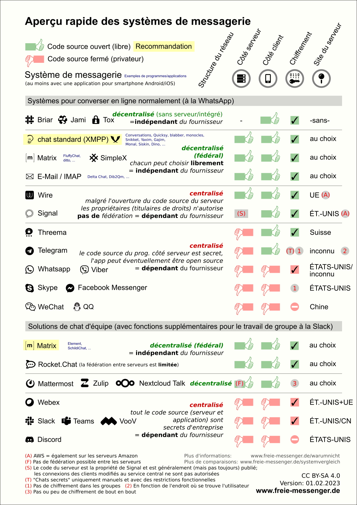

Title: Mettre en service sa propre instance de Matrix avec Bridges
Category: Informatique
Tags: autohébergement, web, social, docker, tchat
Date: 2023-08-01
Status: draft

Pour ceux qui ne connaisse pas encore Matrix, je le présente succinctement ainsi : c'est un outil messagerie moderne, qui est supérieur technologiquement à toutes les autres solution existantes (Instagram, WhatsApp, Messenger, Signal, WeChat, Telegram, Discord, etc ...). Mais ce n'est pas tout, en plus d'être très sécurisé, c'est aussi une solution libre, éthique et décentralisée et en constante évolution grâce à une large communautée très impliquée dans cette solution de messagerie utlime que n'importe qui peux utiliser ou auto-héberger.

Il n'y a donc absolument aucun argument en faveur des autres platformes (même pour Signal oui oui) et dans un monde idéal l'humanitée entière utiliserais Matrix comme solution unique de communiquation.

J'ajoute que tout bon dirigeant d'entreprise qui utilise une solution de tchat en interne doit forcément déployer Matrix pour sa société, tout autre choix sera fondalement moins pertinant, voir dangereux. Le monopôle de Microsoft avec Teams n'est d'ailleur pas un freins, car il est tous à fait possible d'integrer des solutions de Visio comme [Jitsi](https://meet.jit.si) dans l'instance Matrix. Et une fois que nous avons goûté à l'outil, nous sommes rapidement convaincu.

Maintenant que les présentation sont faite, je vais expliquer dans cette note comment déployer simplement une instance avec Docker et surtout avec des Bridges. Je précise que cette note est co-rédigéré avec [Lucas Assier](https://www.linkedin.com/in/lucasassier), qui à également une expérience fraîche avec Matrix de son côté !

# Qui utilise Matrix en 2023 ? 🗣

Je dirais, quasiment personne, comme beaucoup d'outil libre, pas de gros marketing derrière. Même [Signal](https://www.signal.org), qui met pourtant les moyens, peine à concurencer ses concurents qui sont pourtant naze au possible, alors autant dire que Matrix n'est pas prêt de percer sauf si gros buzz, mais patience cela arrivera car contrairement au autre, Matrix est pereine dans le temps et sera là encore bien après eux (l'e-mail, xmpp et irc en sont les preuves). Finalement, les seuls qui ont, en 2023, un interêt à déployer du Matrix, sont les entreprises, associations et organisations qui souhaitent disposer d'un outil de communication en interne. Pour les autres, on y retrouvera majoritairement des Geek élitiste qui ont la chance d'avoir les connaissances.

# Les Bridges ! 🏗

En plus de pouvoir choisir n'importe quel interface de tchat pour votre Matrix (ce qui est déjà génial), Matrix à donc lancé une idée révolutionaire : **Les bridges** !

L'idée est extaorinaire car elle promet récupérer le trafic (donnés et messages) des autres plateformes dans votre instance Matrix, carément !

<i class="fa fa-link"></i> https://matrix.org/ecosystem/bridges

Il faut comprendre que les Bridges sont additionnels et heuresement, car il y à baleine sous gravillon, explication dans le chapitre suivant.

# Le piège des Bridges 🚧

Après plusieurs mois d'utilisation des Bridges, je vais être honnête, c'est un calvaire et la maintenance est chronophage au possible. Les Bridges sont essentiellement des prototypes en Alpha et plus nous en ajoutons plus c'est instable, la maintenance n'en devient que plus lourde.

Chaque Bridge à son lot de galère c'est sans fin, **il faut donc être determiné à y consacrer beaucoup de temps !**

Autrement, la meilleur alternative que je connaisse est [Element-ONE](https://element.io/element-one), payant et avec seulement trois Bridges, mais c'est un début 😉

# Déploiement basique avec Docker 🐳

Si vous êtes à l'aise avec Docker, alors la configuration suivante vous permettra de mettre en place votre instance Martrix. Pour les plus barbus, vous pouvez aussi [jouer avec Ansible](https://github.com/spantaleev/matrix-docker-ansible-deploy) 🤓

...
...
...
...
