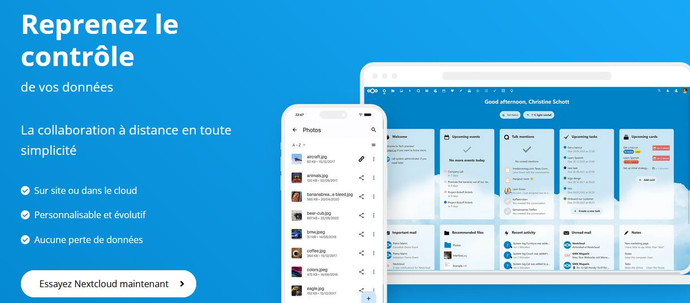

Title: Pourquoi les photos/vidéos de ma fille sont catégoriquement interdites ?
Category: Parentalité
Tags: bébé, enfant, photo, avenir, web, smartphone, vieprivée, nextcloud, dangers
Date: 2023-07-30
Status: published

**Ma femme et moi avons pris la décision d'interdire strictement la prise de photo/vidéo de notre enfant.**

Prendre cette radicale décision en 2023 est incompréhensible pour l'entourage de notre fille. 🤦‍♂

Cela nous coûte encore des disputes et des malentendus, pour cette raison, je vais donc expliquer dans cette note pourquoi nous avons pris cette décision et pourquoi vous devriez en faire autant.

## Une décision absurde ?

Le problème quand nous avons le savoir, c'est que nous n'avons plus la possibilité d'être naïf et irresponsable.

Au même titre qu'un garagiste se sent obligé de faire la vidange de votre voiture avant de vous rendre les clés, je refuse de laisser ma fille à la merci des terribles dangers invisibles de notre époque numérique. Mon bébé a la rarissime chance d'être encore totalement épargnée et cela me serait absolument insupportable de la propulser dans une situation qui ne sera prise réellement au sérieux par tout le monde que dans 10 ans, quand cela sera trop tard pour elle.

J'ai pu prendre le temps d'exposer tout cela à ma femme qui adhère complètement à ma vision, mais cela demande un important effort de réflexion qu'il est difficile d'expliquer à tout le monde.

Mais je vais faire simple dans mon explication et ne pas m'arrêter sur les détails technique.

## Résumons le problème

Il est impossible pour quiconque de nier l'évolution technologique incroyable de notre société depuis les années 2000. L'avènement d'internet et des smartphones change complètement les règles de notre société, il faut commencer par admettre cela.

Tout le monde a donc un espion dans sa poche, très mal configuré, qui viole quotidiennement votre vie privée et celle de votre entourage. Seul quelques dingo comme moi prennent réellement le temps de reconfigurer leur smartphone pour le maîtriser complètement.

Les appareils photos jetables (non-connectés) n'existent plus vraiment et peu de personnes disposent d'appareil photo numérique pro. Par contre, tout le monde est prêt à dégainer son smartphone pour agresser votre innocent bébé qui n'a rien demandé, sans se rendre compte du mal fait 🙁

Le cheminement technique est le suivant :

**Capture de média avec un Smartphone** ➡️ **Fuite des médias sur le web pour l'éternité** ➡️ **Sur-exploitation des médias à très long terme**

Je ne vais pas rentrer dans les détails, sachez juste que c'est une réalité et que tout est **automatisé**. Faites un tour dans les permissions de votre Android/Iphone, analysez vos spams, faites la liste ahurissante d'infos dont disposent les géants du Web à votre sujet et celle de votre entourage. Surtout si vous êtes un naïf "kinarienakaché" 😜, les exemples sont légions.

Heureusement, le sujet deviendra de plus en plus sérieux avec les mesures qui vont avec dans les années à venir. Merci à la [CNIL](https://cnil.fr) et à la [La Quadrature du Net](https://www.laquadrature.net) pour ça !

> Vol; Harcèlement; Discrimination; Vengeance; Escroquerie; Risque lié à la santé; Mauvaise Réputation; Chantage; Diffamation; Espionnage; Usurpation; Désinformation; Conséquences juridique; Surveillance.

Voici la liste des potentiels problèmes que ma fille n'aura, je l'espère, pas à subir plus tard grâce à ma lucidité.

Si vous êtes encore septique, voici une vidéo Allemande de 2023 plutôt persuasive :

## Comment pouvons-nous faire ?

En plus de sensibiliser et d'interdire, il existe des solutions techniques pour ne pas perdre en avantage, cela demande juste de la discipline.

Aujourd'hui, je stocke l'intégralité des données concernant mon enfant sur mon serveur personnel et je surveille et cherche à exterminer toute fuite de données possible.

Aujourd'hui, mon smartphone et celui de ma femme sont maîtrisés à fond les patates pour éviter tout risque. Nous avons également confié un troisième smartphone sécurisé à la nounou.

Pour les documents et médias, nous avons notre propre instance Nextcloud grâce à l'auto-hébergement, nous avons finalement plus de confort numérique que les gens qui utilisent et paient des services non respectueux et pouvons partager un album en ligne pour les proches, etc ...

Mais même sans être informaticien, vous pouvez très bien faire les choses simplement, du papier, du matériel non connecté et une discrétion de ninja auprès des services et magasins vous garantiront le respect de la vie privée de votre famille.

## Cela va beaucoup plus loin

Hélas, les parents vont forcément être la première source de fuite d'information. Même en étant très strict aujourd'hui, ma fille de 6 mois se retrouve déjà à la merci de plusieurs organismes :

* Services publics (obligatoires)
* Services mails (pour les démarches)
* Services de santé ("normalement" très réglementé)
* Pas mal de chaînes de magasin, fabricants et grossistes (par confort)

Après il faut vivre avec son temps, le but étant finalement d'ouvrir les yeux et de garder le contrôle, de faire le nécessaire pour nettoyer ses données dès que possible. De plus en plus de service payant anti data-brokers émergent pour vous protéger si vous êtes fénéant de faire le ménage vous même.

## Lettre ouverte pour mes proches

> Je comprends que tu puisses être surpris que je ne souhaite pas que ma petite fille soit prise en photo/vidéo. Cependant, il y a plusieurs raisons à cela.
>
> * Premièrement, en tant que parent, je souhaite protéger la vie privée de ma fille. En ces temps où la technologie est omniprésente, il est facile de diffuser des photos sans y réfléchir, mais il peut être difficile de contrôler qui a accès à ces images. Je veux m'assurer que les photos de ma fille ne sont pas utilisées à des fins malveillantes ou partagées sans mon autorisation.
> * Deuxièmement, j'aimerais que ma fille développe une image de soi saine. Les réseaux sociaux et les médias en général peuvent créer des pressions sociales négatives, et je souhaite éviter que ma fille ne se compare à d'autres enfants en ligne. Je veux qu'elle apprenne à s'aimer pour qui elle est, sans être influencée par les images qu'elle voit en ligne.
> * Troisièmement, je souhaite que ma fille puisse se concentrer sur l'instant présent et profiter de chaque moment sans se soucier d'être photographiée/filmée. Je veux que les moments passés avec elle soient précieux et que nous puissions nous concentrer sur notre temps ensemble, sans interruption ni distraction.
>
> De plus, je suis préoccupé par la façon dont les photos que nous prenons peuvent être utilisées à l'avenir. Les photos que nous partageons aujourd'hui peuvent être utilisées pour créer des profils en ligne ou pour d'autres usages auxquels nous n'avons pas consenti. En limitant la quantité de photos que nous prenons et en gardant le contrôle de ces images, je souhaite éviter que des informations sensibles sur ma fille ne soient utilisées à des fins inappropriées.
>
> Finalement, en tant que parent, je souhaite protéger la vie privée de ma fille. Nous vivons dans un monde où les données personnelles sont devenues une ressource précieuse, je veux m'assurer que ma fille a le contrôle de ses informations personnelles. Les photos que nous prenons peuvent contenir des informations sur les lieux qu'elle fréquente, les personnes avec qui elle interagit et d'autres détails sensibles. En limitant la quantité de photos que nous prenons et en gardant le contrôle de ces images, je souhaite protéger la vie privée de ma fille.
>
> Je souhaite que ma fille puisse développer sa propre identité sans être influencée par les images que nous partageons en ligne. Les photos que nous prenons peuvent donner une image déformée de qui elle est, et je souhaite qu'elle puisse se développer librement sans être limitée par l'image que nous avons créée pour elle.
>
> J'espère que tu comprends mes préoccupations et que tu respecteras ma décision de ne pas prendre de photos de ma fille, en particulier avec un smartphone. Merci de ton soutien.
