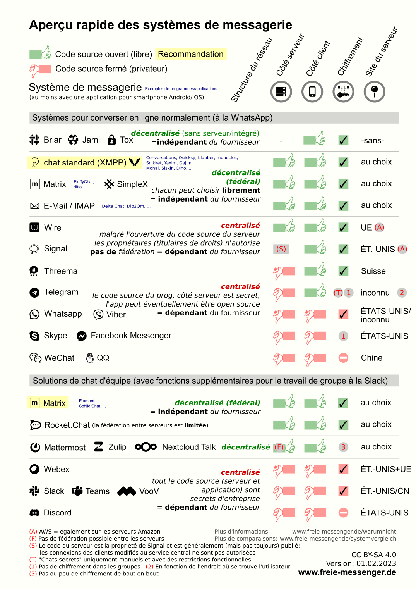
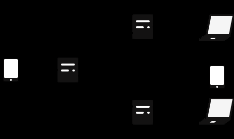
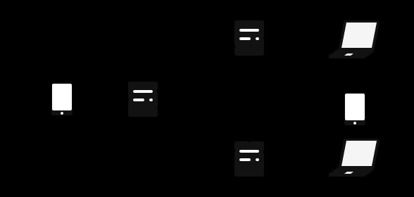
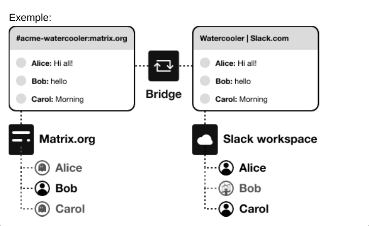
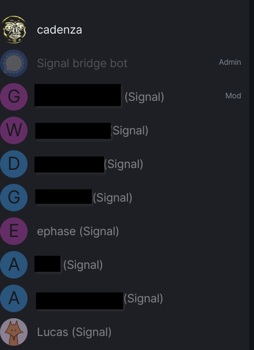
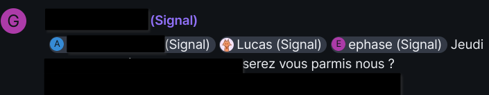
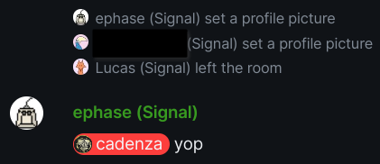

Title: Mettre en service sa propre instance de Matrix avec Bridges
Category: Informatique
Tags: autohébergement, web, social, docker, tchat, communication
Date: 2024-04-08
Status: published

Pour ceux qui ne connaissent pas Matrix, je le présente succinctement ainsi : c'est un outil de messagerie moderne, qui est supérieur techniquement à toutes les autres solutions équivalentes (Instagram, WhatsApp, Messenger, Signal, WeChat, Telegram, Discord, etc ...). 

Mais ce n'est pas tout, en plus d'être très sécurisé, c'est aussi une solution libre, éthique et décentralisée et en constante évolution grâce à une large communauté très impliquée dans cette solution de messagerie ultime en auto-hébergement.

Il n'y a donc absolument aucun argument en faveur des autres plateformes (même pour Signal et RocketChat oui oui) et dans un monde idéal l'humanité entière utiliserait Matrix comme solution unique de communication.

J'ajoute que tout bon dirigeant d'entreprise qui utilise une solution de tchat en interne devrait déployer Matrix pour sa société, tout autre choix sera finalement moins pertinent, voire dangereux. Le monopole de Microsoft avec Teams n'est d'ailleurs pas un frein, car il est tout à fait possible d'intégrer des solutions de Visio comme [Jitsi](https://meet.jit.si) dans l'instance Matrix. Et une fois que nous avons goûté à l'outil, nous sommes rapidement convaincus.



Maintenant que les présentations sont faites, je vais expliquer dans cette note comment déployer simplement une instance avec Docker et surtout avec des Bridges.

Je précise que cette note est co-rédigée avec [Lucas Assier](https://www.linkedin.com/in/lucasassier), qui a également une expérience intéressante avec Matrix de son côté !

Avant de débuter l'aventure, [commencez par créer un compte Matrix](https://app.element.io/#/register). Réservez votre identifiant et profitez-en pour tester Matrix sur les serveurs d'Element.

# Qui utilise Matrix en 2024 ? 🗣

Quasiment personne, comme beaucoup d'outils libres, pas de gros marketing derrière. Même [Signal](https://www.signal.org), qui met pourtant les moyens, peine à concurrencer ses concurrents qui sont pourtant pas terribles, alors autant dire que Matrix n'est pas près de percer, mais patience, car contrairement aux autres, Matrix est pérenne dans le temps et sera là encore bien après eux (l'e-mail, xmpp et irc en témoignent).

Finalement, les seuls qui ont un intérêt à déployer Matrix, sont les entreprises, associations et organisations qui souhaitent disposer d'un outil de communication en interne. Pour les autres, on y retrouvera majoritairement des Geek qui ont la chance d'avoir les ressources et le temps pour maintenir cet outil.

# Les Bridges ! 🏗

En plus de pouvoir [choisir n'importe quel client](https://matrix.org/ecosystem/clients/) (ce qui est déjà génial), Matrix a une fonction vraiment top : **Les bridges** !

Elle vous promet de récupérer vos messages des autres plateformes dans votre instance Matrix !

[<i class="fa fa-link"></i> matrix.org/ecosystem/bridges](https://matrix.org/ecosystem/bridges)

Il faut comprendre que les Bridges sont additionnels et heureusement, car il y a baleine sous gravillon, explication dans le chapitre suivant.

# Le piège des Bridges 🚧

Après plusieurs mois d'utilisation des Bridges, je vais être honnête, c'est un calvaire et la maintenance est chronophage au possible. Les Bridges sont essentiellement des prototypes et plus nous en ajoutons plus c'est le chaos : la maintenance n'en devient que plus lourde.

Chaque Bridge a son lot de galère, c'est sans fin, **il faut donc être déterminé à y consacrer beaucoup de temps !**

Autrement, la meilleure alternative que je connaisse est [Element-ONE](https://ems.element.io/element-one), payant et avec seulement trois Bridges, mais c'est un début 😉

# Déploiement basique avec Docker 🐳

Si vous êtes à l'aise avec Docker, alors la configuration suivante vous permettra de mettre en place votre instance Matrix. Pour les plus barbus, vous pouvez aussi [jouer avec Ansible](https://github.com/spantaleev/matrix-docker-ansible-deploy) 🤓

La configuration générale ici est donc d'installer le moteur Synapse avec sa DB Postgres. Avec seulement ceci, vous pourrez bénéficier d'une instance Matrix qui tourne très bien.

Pour tout le reste, ce sont les Bridges, que vous pouvez simplement commenter pour ne pas les déployer dans un premier temps, (ou jamais ? 😤)

## Docker compose file

```yaml
version: '3'

services:

  # Synapse
  synapse:
    image: matrixdotorg/synapse:latest
    container_name: matrix-synapse
    hostname: matrix-synapse
    restart: unless-stopped
    environment:
      - SYNAPSE_CONFIG_PATH=/data/homeserver.yaml
    volumes:
      - /home/matrix/Synapse:/data
      - /home/matrix/bridges:/bridges
      - /tmp/test:/var/log
    depends_on:
      - matrix-db
    ports:
      - 8448:8448/tcp
      - 8008:8008/tcp

  matrix-db:
    image: postgres
    container_name: matrix-db
    hostname: matrix-db
    restart: unless-stopped
    environment:
      - POSTGRES_USER=synapse
      - POSTGRES_PASSWORD=**********
      - POSTGRESQL_PASSWORD=**********
      - POSTGRES_DB=matrix
      - POSTGRES_INITDB_ARGS=--encoding=UTF-8 --lc-collate=C --lc-ctype=C
    volumes:
      - /home/matrix/Postgres:/var/lib/postgresql/data

# BRIDGES CONTAINERS ##########

  # Signal bridge
  mautrix-signal:
    image: dock.mau.dev/mautrix/signal
    container_name: mautrix-signal
    hostname: mautrix-signal
    restart: unless-stopped
    volumes:
      - /home/matrix/bridges/signal/signald:/signald
      - /home/matrix/bridges/signal/data:/data
    ports:
      - 29328:29328/tcp
    depends_on:
      - synapse
      - signald
      - signal-db

  signald:
    image: docker.io/signald/signald
    container_name: signald
    hostname: signald
    restart: unless-stopped
    volumes:
      - /home/matrix/bridges/signal/signald:/signald

  signal-db:
    image: postgres
    container_name: signal-db
    hostname: signal-db
    restart: unless-stopped
    environment:
      - POSTGRES_USER=mautrixsignal
      - POSTGRES_DATABASE=mautrixsignal
      - POSTGRES_PASSWORD=**********
    volumes:
      - /home/matrix/bridges/signal/Postgres:/var/lib/postgresql/data

  # Discord bridge
  mautrix-discord:
    image: dock.mau.dev/mautrix/discord
    container_name: mautrix-discord
    hostname: mautrix-discord
    restart: unless-stopped
    volumes:
      - /home/matrix/bridges/discord/data:/data
    ports:
      - 29334:29334/tcp
    depends_on:
      - synapse

  # Whatsapp bridge
  mautrix-whatsapp:
    image: dock.mau.dev/mautrix/whatsapp
    container_name: mautrix-whatsapp
    hostname: mautrix-whatsapp
    restart: unless-stopped
    volumes:
      - /home/bridges/whatsapp/data:/data
    ports:
      - 29318:29318/tcp
    depends_on:
      - synapse

  # Facebook bridge
  mautrix-facebook:
    image: dock.mau.dev/mautrix/facebook
    container_name: mautrix-facebook
    hostname: mautrix-facebook
    restart: unless-stopped
    volumes:
      - /home/matrix/bridges/facebook/data:/data
    ports:
      - 29319:29319/tcp
    depends_on:
      - synapse

  # Instagram bridge
  mautrix-instagram:
    image: dock.mau.dev/mautrix/instagram
    container_name: mautrix-instragram
    hostname: mautrix-instagram
    restart: unless-stopped
    volumes:
      - /home/matrix/bridges/instagram/data:/data
    ports:
      - 29330:29330/tcp
    depends_on:
      - synapse

  # Telegram bridge
  mautrix-telegram:
    image: dock.mau.dev/mautrix/telegram
    container_name: mautrix-telegram
    hostname: mautrix-telegram
    restart: unless-stopped
    volumes:
      - /home/matrix/bridges/telegram/data:/data
    ports:
      - 29317:29317/tcp
    depends_on:
       - synapse

# Slack bridge
mautrix-slack:
  image: dock.mau.dev/mautrix/slack
  container_name: mautrix-slack
  hostname: mautrix-slack
  restart: unless-stopped
  volumes:
    - /home/matrix/bridges/slack/data:/data
  ports:
    - 29335:29335/tcp
 depends_on:
    - synapse

# Wechat bridge 
matrix-wechat:
  image: lxduo/matrix-wechat
  container_name: matrix-wechat
  hostname: matrix-wechat
  restart: unless-stopped
  volumes:
    - /home/heuzef/matrix/bridges/wechat/data:/data
  ports:
    - 17778:17778/tcp
  depends_on:
    - synapse

# Wechat agent
agent-wechat:
  image: lxduo/matrix-wechat-docker
  container_name: agent-wechat
  hostname: agent-wechat
  restart: unless-stopped
  environment:
    - WECHAT_HOST=wss://matrix-wechat/_wechat/
    - WECHAT_SECRET=00000000000
  volumes:
    - /home/heuzef/matrix/bridges/wechat/hongli/:/home/user/matrix-wechat-agent
  depends_on:
    - matrix-wechat
```

## Configuration de Synapse

Générer le fichier de config Synapse : 

```
docker run -it --rm -v /home/matrix/Synapse/:/data -e SYNAPSE_SERVER_NAME=matrix.domain.tld -e SYNAPSE_REPORT_STATS=no matrixdotorg/synapse:latest generate
```

Ce fichier de configuration sera généré dans  **/home/matrix/Synapse/homeserver.yaml**, plutôt simple à comprendre, voici quelques paramètres à modifier selon vos besoins :

```yaml
max_upload_size: 100M
enable_registration: true
enable_registration_without_verification: true
app_service_config_files:
    - /bridges/discord/data/registration.yaml
    - /bridges/facebook/data/registration.yaml
    - /bridges/instagram/data/registration.yaml
    - /bridges/signal/data/registration.yaml
    - /bridges/slack/data/registration.yaml
    - /bridges/telegram/data/registration.yaml
    - /bridges/wechat/data/registration.yaml
    - /bridges/whatsapp/data/registration.yaml
```

Chaque fichier de configuration des bridges est similaire, les paramètres récurrents à modifier sont les suivants :

```yaml
homeserver:
    address: https://matrix.domain.tld
    domain: matrix.domain.tld
    address: http://<hostname>:<port>
    hostname: 0.0.0.0
    port: <port>
    database:
        type: sqlite3
        uri: <bridge>-db.sqlite
    permissions:
        "*": relay
        "matrix.domain.tld": user
        "@votre-pseudo:matrix.domain.tld": admin
```

Maintenant, vous pouvez démarrer toute la tambouille : ``docker compose -f /home/matrix/docker-compose.yml up``

Le premier lancement prend du temps, les fichiers de configuration et de **registration.yaml** doivent être générés par Synapse (n'anticipez pas leur création), confirmant que tout fonctionne correctement, ensuite, vous pouvez éditer les paramètres.

Vous aurez probablement une erreur de permission sur ces fichiers au lancement, ajustez simplement cela ainsi :

```bash
sudo chmod 644 /home/matrix/bridges/*/data/registration.yaml
```

## Visioconférence

Si vous souhaitez utiliser la visioconférence, notez bien que cette dernière ne fonctionnera qu'en local sur votre réseau interne. Pour aller plus loin et profiter pleinement des fonctionnalités de la visioconférence, il vous faudra mettre en service un serveur TURN : [Configuring a Turn Server - Synapse](https://matrix-org.github.io/synapse/latest/turn-howto.html)

# Mon retour d'expérience sur les différents Bridges 📢

Vous remarquerez que la plupart des Bridges sont déployés via [MAUTRIX](https://docs.mau.fi/bridges/general/docker-setup.html?bridge=telegram&ref=infos.zogg.fr). Ce n'est pas pour rien, car la plus grande panoplie est éditée par eux et ce sont aussi bien souvent les bridges les plus stables.

Pour rappel [la liste des Bridges est diffusée sur le site officiel de Matrix](https://matrix.org/ecosystem/bridges/).

De façon générale, la logique d'ajout d'un bridge est toujours la même :

1. Exécution du bridge

2. Depuis votre client Matrix préféré, rechercher le bot du bridge pour commencer une discussion avec lui

3. Dans le canal de discussion avec le bot taper ``help`` pour afficher les actions possibles

## Signal

Le Bridge de Signal est un peu lourd à mettre en place, car il réclame une DB à part (ce que je vous conseille vivement de faire pour les performances).

1. Inviter @signalbot
2. Enregistrez votre téléphone ``register +33000000000``
3. Récupérer un jeton captcha sur le site dédié de signal
   - https://signalcaptchas.org/registration/generate.html
   - Récupérer le token situé juste après le **signalcaptcha://signal-recaptcha-v2.**
4. Valider le code SMS
5. Définir son nom : ``set-profile-name VOTRE-NOM``

## Discord

Pour Discord, la première initialisation ne permet que de jongler avec les messageries privées, vous aurez ensuite besoin de jouer avec les commandes des bridges pour rejoindre les différents canaux (plus communément appelés "Serveurs Discord" par les Moldus) via leur identifiant unique.

Ensuite, c'est le gros dawa, si vous invitez une guilde assez grosse, vous allez vous retrouver avec autant de notifications d'invitation à accepter que de catégories ! Bon une fois que c'est validé, vous êtes tranquilles, mais faites très attention aux journaux qui vont être générés sur votre serveur, ça va très rapidement remplir l'espace disque s'il y a de l'activité sur vos canaux Discord !

1. Inviter @discordbot

2. Sur l'application mobile : *paramètres de l'app > "Scanner le QR code"*

3. Envoyer la commande au bot : ``login-qr``

4. La commande ``guilds status`` permet d'afficher les différents "Serveurs Discord"

## WhatsApp

Alors WhatsApp, pour faire simple, dispose d'une sécurité très désagréable qui consiste à déconnecter tous vos accès tiers après une semaine, super ...

Cela concerne donc également votre Bridge qu'il vous faudra reconnecter avec un QRCode toutes les semaines. Donc nous sommes bien forcés de conserver l'application officielle sur notre tel uniquement pour ça ... voilà voilà ... 👌

1. Inviter @whatsappbot
2. Sur l'application mobile : *paramètres de l'app > "Scanner le QR Code"*
3. Envoyer la commande au bot : ``login``

## Facebook et Instagram

Dans le même type de flood absurde que Discord, vous allez recevoir une notification d'invitation à accepter pour chaque personne ... J'espère pour vous que vous êtes un asocial avec peu d'amis sur ces plateformes, sinon vous allez user votre souris à accepter des centaines d'invitations une par une.
Un conseil, testez bien vos volumes docker, le redémarrage du Bridge a tendance à tout remettre à zéro, histoire de vous pousser au suicide une bonne fois pour toutes 😖

## Telegram

Un peu plus long à mettre en place, le bot étant encore en prototype au moment de mon test, mais ensuite, cela fonctionne correctement.

Sur la configuration, il est nécessaire d'ajouter une clef d'API récupérable sur : https://my.telegram.org/apps

```yalm
App api_id: 00000000
App api_hash: 00000000000000000000000000000000 
```

1. Inviter @telegrambot
2. Sur l'application mobile : *paramètres de l'app > "Scanner le code QR"*
3. Envoyer la commande au bot : ``login-qr``

## WeChat

La palme d'or de la torture revient à nos amis Chinois avec leur outil abominable.

Créé par un nerd Chinois répondant au nom de [lxduo](https://github.com/duo/matrix-wechat-docker), ce dernier (probablement considéré comme un terroriste par le PCC), a eu la patience de mettre au monde un Bridge capable de s'accoupler avec cette horreur de WeChat.

Ce qui donne naissance à une terrible usine à gaz qui vous servira d'hôte, qu'il vous faudra accompagner d'autant d'usines à gaz supplémentaires que vous souhaitez ajouter de compte WeChat ... Le gros délire en termes de consommation de ressource 😭.

Bon dans mon cas [je n'ai même pas réussi à le faire tomber en marche](https://github.com/duo/matrix-wechat-docker/issues/2) et à vrai dire, j'ai sûrement été banni de l'outil par le gouvernement car impossible de me créer un compte, j'ai donc renoncé.
Je prévois un voyage en Chine en 2024, je vais en profiter pour me créer un compte en catimini avec un numéro sur place, je ferais peut-être un article à ce sujet un jour si c'est croustillant.

1. Inviter @wechatbot
2. Sur l'application mobile : *paramètres de l'app > "Scanner le code QR"*
3. Envoyer la commande au bot : ``login`` pour tenter de détecter l'agent WeChat

## SMS

En bonus, j'ai tenté l'utilisation de [SmsMatrix](https://f-droid.org/en/packages/eu.droogers.smsmatrix/), une application Android qui peut fonctionner avec un Bridge, j'ai fait fonctionner le machin ainsi :

S'authentifier sur le compte **@smsbot:matrix.domain.tld** et inviter son compte utilisateur pour créer un canal de discussion.
Après autorisation, installer SmsMatrix sur votre téléphone :

```
Bot Username : smsbot
Bot Password : **********
Homeserver url : https://matrix.domain.tld
Your username @<USER>:matrix.com
Devicename : <NOM-DU-TEL>
```

Il suffit ensuite de recevoir un SMS pour initialiser une conversation.

# Conclusion 🗒

- Matrix, c'est le top du top de la messagerie. Tant sur l'aspect technique qu'éthique.

- Peu de personnes connaissent et n'utilisent ça dans le monde pro et encore moins ailleurs.

- La configuration d'un serveur TURN supplémentaire est nécessaire si vous souhaitez profiter de la Visioconférence.

- La configuration des Bridges est très chronophage et instable.

C'est tout pour moi 😉 je vous relaie maintenant les notes de mon ami [Lucas Assier](https://www.linkedin.com/in/lucasassier), qui souhaite également partager son expérience avec Matrix.
Sans aller aussi loin que moi sur la quantité de Bridges testés, il a cependant abordé le Double Puppetting, très intéressant pour profiter pleinement des Bridges.

----

L'article ci-dessous, rédigé par [Lucas Assier](https://www.linkedin.com/in/lucasassier), date de Septembre 2023.

----

# Pourquoi Matrix

À cela plusieurs raisons et cas d'usages :

- En premier, les communications sont chiffrées, dans la mesure du possible, par design, ce qui permet de discuter avec des amis de sujets sensibles sans avoir à se soucier de voir nos communications et pièces jointes sur un CDN random (N'est-ce pas Discord ?).

- En second, le système de fédération : un utilisateur d'un serveur peut communiquer sur un serveur différent de manière transparente. J'ai pu voir cela l'an dernier sur l'instance de visioconférence de la Fosdem qui n'est autre qu'une instance Matrix avec un plugin jitsi

- Le système de bridges : Le protocole de serveur Matrix a été pensé pour inclure un système de "passerelles" permettant de lier un service quelconque à Matrix. C'est notamment ce système qui m'a poussé à passer le pas et à déployer ma propre instance Matrix.

# Terminologie

## Provider

Matrix, c'est un peu comme le système de mails, il faut un fournisseur ou **provider** pour pouvoir communiquer. Pour cela, un **homeserver** va leur donner un compte, exemple :



## Homeserver

Un **homeserver** est un serveur Matrix (Synapse, Conduit, etc ...).

Il est lié à un seul domaine qui n'est pas voué à changer.
Les comptes générés via les **homeserver** sont en deux parties comme suit :

`@user@homeserver.tld`

Pour reprendre l'exemple ci-dessus, cela donnerait :



## AppService

C'est ce que l'on peut comparer à un bot standard.
Les AppServices doivent être enregistrés dans la configuration du serveur, il n'est pas possible de les enregistrer à la volée.

## Bridges

Un bridge est un système permettant de connecter un groupement Matrix à une autre plateforme, par exemple, Slack ou encore Signal.

Les bridges fonctionnent de deux manières :

1. Dans Matrix, les utilisateurs des autres plateformes sont vus en tant que "*ghost*".

2. Dans l'autre plateforme, les comptes utilisateurs de Matrix sont appelés des "*puppets*".

Exemple :



Les spécifications Matrix sont complexes mais entièrement documentées [ici](https://spec.matrix.org/latest/).

# Choisir son serveur

Aujourd'hui, Matrix possède plusieurs implémentations serveur plus ou moins abouties.
Il y en a trois qui ont retenu mon attention :

1. **Synapse** - la référence originale en python. C'est le seul projet de serveur marqué comme stable.

2. **Conduit** - une implémentation en *RUST* du protocole serveur de Matrix mais avec une empreinte mémoire plus faible.

3. **Dendrite** - la même volonté que Conduit, mais en *GO*. Certaines fonctions sont manquantes, la priorité étant l'implémentation des fonctions pour les instances single user.

# Monter son homeserver

## Préparations

Pour des raisons pratiques, nous allons assumer que le serveur retenu est Synapse (car officiel et implémente l'intégralité des fonctionnalités).
En premier lieu, il faut réfléchir à un nom de domaine, c'est très important car il est
impossible de le changer une fois le serveur installé.

Ensuite, il y a plusieurs manières d'installer un serveur Synapse :

1. Via un package manager

2. Via Ansible

3. Via Docker

Ici, nous verrons via Docker.

## La stack technique de la démo

### Un reverse-proxy

Initialement, le projet est déployé dans une colocation de homelabs derrière un seul et même port.

Par conséquent, nous passons par Caddy afin de faire le routage en reverse-proxy.

Cela peut être contraignant, mais il est quand même nécessaire d'en avoir un avec Synapse, notamment quand on va vouloir faire de la délégation.

### Une instance Docker

Pour héberger le serveur ainsi que les bridges, le serveur et les bridges seront en deux stacks Docker-compose séparés.

## Déployer le serveur Synapse

```yaml
version: '3'
services:
    synapse:
        container_name: synapse
        image: docker.io/matrixdotorg/synapse:latest
        restart: unless-stopped
        environment:
            - SYNAPSE_CONFIG_PATH=/data/homeserver.yaml
        volumes:
            - synapse-data:/data
        depends_on:
            - synapse-db
        ports:
            - 8448:8448/tcp # Federation Traffic
            - 8008:8008/tcp # Client Traffic
        networks:
            - default
            - bridgenet

    synapse-db:
        container_name: synapse-pgsql
        image: docker.io/postgres:12-alpine
        environment:
            - POSTGRES_USER=synapse
            - POSTGRES_PASSWORD=changeme!
            - POSTGRES_DB=synapse
            - POSTGRES_INITDB_ARGS=--encoding=UTF-8 --lc-collate=C --lc-ctype=C
        volumes:
            - synapse-pgsql:/var/lib/postgresql/data
        volumes:
            synapse-data: {}
            synapse-pgsql: {}
        networks:
            bridgenet:
                name: synapse_bridges
                external: true
```

> À noter, nous avons un réseau Docker dédié à l'intercommunication entre Synapse et les Bridges installés comme suit :
> 
> `docker network create synapse_bridges`

En premier lieu, il faudra lancer Synapse pour lui dire de générer la configuration :

`docker-compose run --rm -e SYNAPSE_SERVER_NAME=matrix.kestrel.ovh -e
SYNAPSE_REPORT_STATS=no synapse generate`

En suivant, il faudra éditer la configuration `homeserver.yaml` dans le volume synapse-data. 

Il sera important de regarder les options de configuration, notamment la configuration de la connexion à la base Postgres, le nom du serveur (*server name*), les serveurs de clés de confiance ainsi que l'option pour autoriser la création de comptes ou non. 

Une fois cela fait, nous pouvons démarrer la stack via `docker compose up`. 

> On pourrait faire en background mais comme nous en sommes à la phase de lancement initiale, je préfère laisser en premier plan afin de voir si l'application lance des erreurs ou non.

## Configurer le reverse proxy et setup une délégation

Par délégation, nous sous-entendons relayer le trafic Matrix à une entité dans un sous-domaine ou ailleurs.

Ici, mon server name est `kestrel.ovh`, pour autant, le trafic est délégué vers `matrix.kestrel.ovh` via la configuration suivante :

```json
kestrel.ovh {
       header /.well-known/matrix/* Content-Type application/json
       header /.well-known/matrix/* Access-Control-Allow-Origin *
       respond /.well-known/matrix/server `{"m.server":
"matrix.kestrel.ovh:443"}`
       respond /.well-known/matrix/client `{"m.homeserver":
{"base_url":"https://matrix.kestrel.ovh"}}`
}
matrix.kestrel.ovh {
       reverse_proxy /_matrix/* 192.168.1.102:8008
       reverse_proxy /_synapse/client/* 192.168.1.102:8008
}
```

Il existe [une documentation](https://matrix-org.github.io/synapse/latest/reverse_proxy.html) sur la configuration de divers reverse-proxy pour Matrix, avec ou sans délégation.
Pour tester si la configuration est correcte, on peut utiliser [le testeur de fédération](https://federationtester.matrix.org) et voir si le trafic de fédération est OK.

## Créer des comptes

Pour créer des comptes, il est possible de passer via une interface cliente Matrix telle que [Element](https://app.element.io/#/register).

Pour les serveurs qui n'acceptent pas la création de comptes, il est possible de le faire via le conteneur Synapse via la commande suivante :

`docker exec -it synapse register_new_matrix_user http://localhost:8008 -c
/data/homeserver.yaml`

Synapse demandera quelques questions puis créera les comptes.

Personnellement, j'ai opté pour un compte admin dont je me sers uniquement pour l'administration du serveur ainsi qu'un utilisateur standard pour mon usage quotidien.

À ce stade, nous avons une instance Matrix fonctionnelle, avec un compte. Nous pouvons donc nous pencher sur l'ajout de Bridges !


# Ajouter un Bridge

> Le déploiement d'un Bridge peut être long et fastidieux, par conséquent, nous ne verrons que pour le Bridge Mautrix-signald


## Docker Compose 2: Electric Boogaloo

```yaml
version: "3.7"

services:
    mautrix-signal:
        container_name: mautrix-signal
        image: dock.mau.dev/mautrix/signal
        restart: unless-stopped
        volumes:
            - mautrix-signal-data:/data
            - mautrix-signal-signald:/signald
        depends_on:
            - signald
        networks:
            - default
            - bridgenet # Communication w/ Synapse

    signald:
        container_name: signald
        image: docker.io/signald/signald
        restart: unless-stopped
        volumes:
            - mautrix-signal-signald:/signald

    mau-signal-db:
        container_name: mau-signal-db
        image: postgres:13-alpine
        restart: unless-stopped
        environment:
            POSTGRES_USER: mautrixsignal
            POSTGRES_DATABASE: mautrixsignal
            POSTGRES_PASSWORD: changeme!
        volumes:
            - mautrix-signal-db:/var/lib/postgresql/data

volumes:
    mautrix-signal-data: {}
    mautrix-signal-signald: {}
    mautrix-signal-db: {}

networks:
    bridgenet:
        name: synapse_bridges
        external: true
```

Ici, pas énormément de choses à dire, on lance la DB, puis signald (en vérifiant que cela ne crash pas). Ensuite, on lance le Bridge qui crée un fichier de configuration.

Il faudra remplir le fichier avec les informations comme :

* L'adresse du serveur Synapse
* L'adresse du conteneur du bridge (Pour que Synapse relaie nos messages)
* Désactiver le manhole
* Régler les permissions
* Connecter la base postgres


## Enregistrer une AppService dans Synapse

Une fois cela fait, on relance le conteneur. Si tout est correct, celui-ci va générer un fichier `appservice.yaml`

Il faudra le copier dans le volume du conteneur synapse et le référencer comme suit dans la configuration `homeserver.yaml`

```yaml
# NB: Il est pas necessaire de faire de sous-dossiers appservices mais c'est
plus sympa.
app_service_config_files:
    - /data/appservices/mau-signal.yaml
    - /data/appservices/mau-instagram.yaml
    - /data/appservices/mau-slack.yaml
```

Une fois ceci fait, relancer Synapse ainsi que le Bridge. Si tout fonctionne, le bot doit être joignable via message privé à l'adresse **@signalbot:homeserver.tld**

## Se connecter à Signal

Pour se connecter à Signal, il faudra ouvrir un canal avec le bot, puis choisir une des deux options possibles :

`**link** [device name] - Link the bridge as a secondary device`
`**register** <phone> - Sign into Signal as the primary device`

Malheureusement, j'ai eu une erreur quand j'ai voulu "register" donc je suis passé via "link", le bot fournit un QR Code permettant de s'authentifier.

Une fois l'authentification effectuée, vous recevrez tout un tas d'invitations de messages privés et de canaux. 

Ceux-ci sont gérés via le bot et font le lien avec toutes les conversations présentes sur Signal.

Par exemple, ici, un canal avec des amis :




> À noter, le bot est présent dans chaque room afin de faire le lien. Il est possible de lui parler directement via `!signal` ou via MP.
> En gris, tous les utilisateurs ayant le tag `(signal)` sont des "**ghosts**" contrôlés par le bot.

> Il est bon de noter aussi que nous ne sommes pas administrateur du canal mais que les admins du groupe Signal le sont par extension sur ce canal Matrix.

## Le Double Puppetting

Sur la capture d'écran précédente, nous avons pu voir que je possède deux comptes, un compte Matrix et un compte Signal.

On pourrait dire que l'on s'en fiche dans certains cas mais cela pose problème lorsque les gens veulent me mentionner. 

Exemple ici :



Ici on me mentionne pour un événement. Problème, le Bridge mentionne mon compte Signal et non moi-même.
Pour pallier cela, les développeurs ont ajouté une fonction permettant de remplacer le compte de la plateforme en question (Ici, *Lucas(Signal)* ) par mon propre compte Matrix.

Pour ce faire, il est possible de passer par deux manières de faire :

* À la main via des "access tokens (à coup de `curl` puis via des MP aux différents bots de Bridge).

* Automatiquement via [ce plugin](https://github.com/devture/matrix-synapse-shared-secret-auth). Pour des raisons évidentes, nous allons passer par le plugin.

### Installer le module Shared Secret Authenticator

Pour installer le module, il faudra cloner depuis le dépôt GIT, le fichier python, puis l'ajouter aux volumes du conteneur synapse.

Cloner le dépôt : `git clone https://github.com/devture/matrix-synapse-shared-secret-auth`

Puis l'ajouter en tant que volume :

```yaml
[...]
    volumes:
        - synapse-data:/data
        - /opt/matrix-synapse-shared-secret-auth/shared_secret_authenticator.py:/usr/local/lib/python3.11/site-packages/shared_secret_authenticator.py
```

Générer un secret : `pwgen -s 128 1`

Puis, dans le fichier `homeserver.yaml`, saisir les informations recensées dans le GIT croisées avec [la documentation de Mautrix](https://docs.mau.fi/bridges/general/double-puppeting.html).

```yaml
modules:
    - module: shared_secret_authenticator.SharedSecretAuthProvider
        config:
            shared_secret: "YOUR_SHARED_SECRET_GOES_HERE"
            m_login_password_support_enabled: true
            com_devture_shared_secret_auth_support_enabled: false
```

Une fois cela fait et le conteneur Synapse relancé, dans la configuration du Bridge Signal, remplacer :

```yaml
double_puppet_server_map:
        example.com: https://example.com
    login_shared_secret_map:
        example.com:
```

```yaml
double_puppet_server_map:
        kestrel.ovh: http://synapse:8008
    login_shared_secret_map:
        kestrel.ovh: YOUR_SHARED_SECRET_GOES_HERE
```

Ceci fait, relancer le conteneur Signal.
Si cela fonctionne correctement, le compte en trop doit disparaître et les mentions envers ce compte sont maintenant redirigées vers l'utilisateur Matrix correct.



