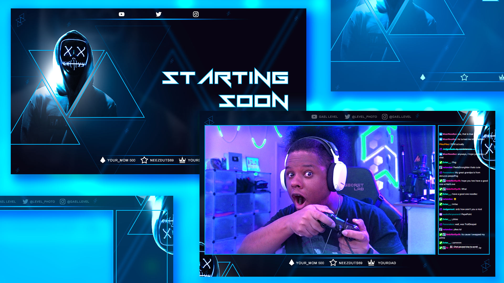

Title: Diffuser élégamment durant vos visio-conférences
Category: Informatique
Tags: web, social, twitch, youtube, facebook, live, visio, webcam
Date: 2024-05-05
Status: published

La visio est pour beaucoup de monde aujourd'hui un acte quotidien, que vous soyez un professionnel de la tech ou non.

Si vous faites partie de ces gens qui visiote, qui teams, qui zoom, qui meets et autre termes à la mode pour ne simplement pas dire participer à une vidéo-conférence, je vous recommande de vous intéresser à l'utilisation d'un outil aussi simple qu'efficace, j'ai nommé [OBS Studio](https://obsproject.com/fr/).

# Qu'est-ce que OBS Studio et pourquoi c'est utile ? 🎥

OBS Studio est un outil très utilisé par les vidéastes, en particulier sur Twitch ou Youtube dans le domaine du Jeux-Vidéo (Let's play).

Ce dernier vous permet d'avoir un contrôle complet de ce que vous diffusez avec votre webcam, plus que simplement votre tête avec un filtre automatique en tout cas.

Il est très intéressant pour les raisons suivantes :

* Il permet de créer une "webcam virtuelle" personnalisable à souhait

* Il est facile à prendre en main

* Il est gratuit

* Il est libre

* Il est open source

* Il est multi-OS

Difficile d'en demander plus ! Dédiez votre prochain dimanche pluvieux pour découvrir tranquillement ce logiciel, croyez-moi vous aller vous amuser et cela sera très utile pour vous pour la suite.

Dans cet article, je ne vais pas faire un tuto, car pour ça, je vous invite à chercher sur Youtube, les vidéos très complètes des dernières versions ne manques pas, ici le but est seulement de vous convaincre de franchir le pas.

# Le fonctionnement (dans les grandes lignes) ⚙️

Au lancement, OBS Studio vous affichera une interface de gestion qui comprend 3 grandes catégories.

## Les contrôles

La zone de contrôle vous permet de lancer un enregistrement, démarrer votre caméra virtuelle pour l'exploiter via un autre logiciel (de visio par exemple 😉) ou encore de démarrer une diffusion (si vous connectez un service tiers tel que Youtube, Twitch, ...).

## Les scènes

C'est une fonction très pratique de OBS Studio qui vous permet de créer plusieurs "environnements" de diffusion selon la situation.

Votre scène par défaut peut simplement afficher votre tête, mais vous pourriez créer une scène dédiée à votre partage d'écran par exemple. La bascule entre les scènes se fait un clic.

Dans mon cas pratique, j'ai créé une scène "attente" qui affiche une vidéo Youtube lorsque je dois m'absenter durant la visio, une autre qui affiche ma tête en plus de mon partage d'écran. Une autre encore qui me permet de partager 4 fenêtres en même temps ou même 4 webcams à la fois ... Pas de limite de scène, c'est selon votre imagination.

## Les sources

Les sources sont simplement les entités que vous souhaitez ajouter dans votre diffusion :

* Webcams

* Images

* Vidéo

* Texte

* Logiciel

* Audio (micro, lecteur musique, ...)

* ...

Vous importez tous les éléments que vous souhaitez dans votre scène pour les placer dans l'interface.

C'est très intuitif et vous n'aurez aucun mal à créer une diffusion super cool qui vous ressemble.

Voilà, si vous avez compris ça, vous avez compris le plus important. Il est possible d'aller plus loin, en modifiant les sources dynamiquement avec des effets (correction de couleurs, redimensionnement, etc ...).

Et pour les plus nerds, il est même possible d'aller jusqu'à contrôler OBS via de la Computer Vision 🤖.

# Essayez ! 👌

J'espère que cette présentation vous donnera envie de personnaliser votre diffusion pour vous rendre un peu plus coquet dans vos réunions 🌸

Sans aller jusqu'à mettre en place des Overlays impressionnants comme les vidéastes pro, il y a une dimension vraiment utile pour maîtriser ce que vous diffusez lors d'une visio.

[Amusez-vous bien !](https://www.youtube.com/results?search_query=OBS+Studio+fr)
