Title: Realiser une œuvre d'art avec des techniques modernes
Category: Art
Tags: art, ia, python, photo, pao, 3D
Date: 2024-11-05
Status: published

Du pixel à la matière, je vous dévoile les différentes étapes m'ayant permis de réaliser une œuvre hybride né de l'IA, de la PAO et de la 3D. Ce projet met en évidence la synergie entre les outils numériques, l'intelligence artificielle et les savoir-faire artisanaux pour donner naissance à une œuvre unique : **un portrait en l'honneur de Nikola Tesla**.

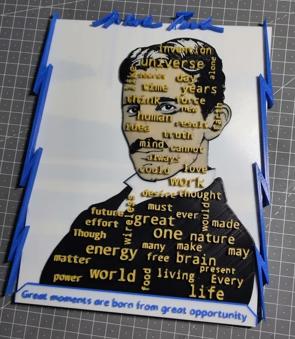 

# Partie 1 : La genèse numérique

Nikola Tesla, c'est un peu le boss final des inventeurs. Archétype du savant fou, ce dernier a profondément changé l'avenir de l'humanité.

Résumer un tel personnage n'est pas simple, mais s'il est facile de se renseigner sur lui, c'est cependant plus délicat de trouver des photos de bonne qualité du monsieur. Voici la plus célèbre et sûrement de meilleure qualité :

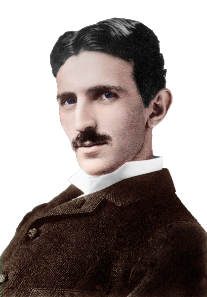 

En contemplant cette photo, mon inspiration pour l'œuvre est née grâce aux nombreuses citations célèbres de Tesla. En voici quelques unes :  

> Si vous voulez trouver les secrets de l'univers, pensez en termes d'énergie, de fréquence et de vibration.

> Je ne me soucie pas qu'ils aient volé mon idée… Je m'inquiète du fait qu'ils n'en aient pas eux-mêmes.

> Le présent est à eux ; le futur, pour lequel j'ai réellement travaillé, est mien.

Ainsi, à ce stade, j'ai fixé l'objectif de réaliser un portait de la photo en 3D, pour ajouter une profondeur dans son regard, afin de donner l'illusion qu'il nous suit du regard, mais également faire ressortir en lettre d'or les mots les plus "forts" de l'inventeur (littéralement).  

Pour réussir à sélectionner les mots justes, j'ai donc commencé par collecter une centaine de citations trouvé sur le site [quotefancy.com](https://quotefancy.com/nikola-tesla-quotes)

J'ai donc codé la stratégie de webscraping en Python suivante :

```python
# Import des librairies nécessaires au projet
import pandas as pd
import requests
from bs4 import BeautifulSoup

# Fixer les pages contenant les 100 citations
page1 = requests.get("https://quotefancy.com/nikola-tesla-quotes/page/1")
page2 = requests.get("https://quotefancy.com/nikola-tesla-quotes/page/2")
page3 = requests.get("https://quotefancy.com/nikola-tesla-quotes/page/3")

# Extraire les citations
soup = BeautifulSoup(page1.content, "lxml")
quotes_p = soup.find_all("p", class_="quote-p")

quotes = []
for i in range(0, 50):
    quote = quotes_p[i]
    quote_a = quote.select("a")
    for content in quote_a:
        quotes.append(content.text)
```


Même logique, avec les 2 pages suivantes, pour alimenter notre array  :

```python
soup = BeautifulSoup(page2.content, "lxml")
quotes_p = soup.find_all("p", class_="quote-p")

for i in range(0, 50):
    quote = quotes_p[i]
    quote_a = quote.select("a")
    for content in quote_a:
        quotes.append(content.text)

soup = BeautifulSoup(page3.content, "lxml")
quotes_p = soup.find_all("p", class_="quote-p")

for i in range(0, 13):
    quote = quotes_p[i]
    quote_a = quote.select("a")
    for content in quote_a:
        quotes.append(content.text)
```

Nous obtenons ainsi, 113  citations, cela me permet ainsi de les récolter dans un fichier tableur au format CSV, exploitable pour la suite.

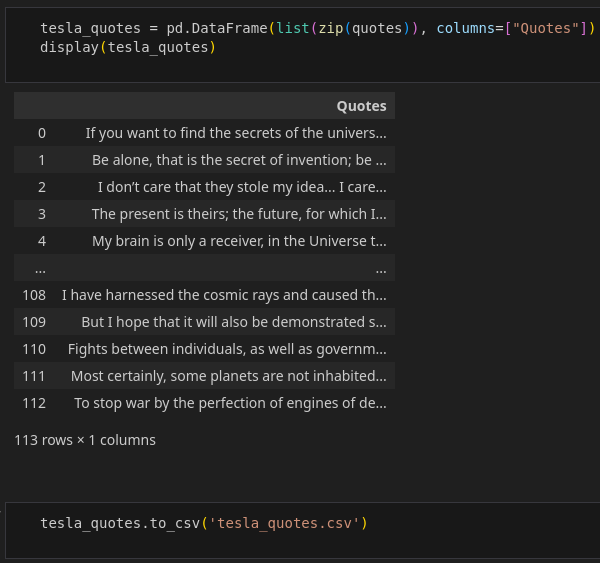 

*NB : les citations sont en anglais, bien que Tesla parlait couramment huit 
langues, il adopta naturellement l'anglais comme langue principale pour 
la communauté scientifique.*

J'ai ensuite exploité, toujours en Python, la librairie NLTK pour faire du text mining et afficher un nuage de mot avec Wordcloud.

```python
# Import des librairies nécessaires au projet
import numpy as np
import pandas as pd
import nltk
from collections import Counter
from nltk.tokenize import TweetTokenizer
from nltk.corpus import stopwords
from wordcloud import ImageColorGenerator, WordCloud
import matplotlib.pyplot as plt
import matplotlib.image as mpimg
from PIL import Image
```

```python
# Chargement des citations dans un dataframe
df = pd.read_csv("tesla_quotes.csv", index_col = 0)

# Créer une chaîne de caractères contenant la concaténation de toutes les citations
paroles = ' '.join(df['Quotes'].astype(str).tolist()) # Attention à insérer une espace entre chaque ligne.

# Creation des tokens
tokenizer = TweetTokenizer()
tokens = tokenizer.tokenize(paroles)
```

Je dispose mainenant de 2818 mots, il faut les nettoyers, en supprimant les stop words.

```python
# Création des stop words, afin de nettoyer nos citations
nltk.download('stopwords')
stop_words = set(stopwords.words('english'))
stop_words.update(["?", "!", ".", ",", ":", ";", "-", "--", "...", "\"", "'", "’"])

tokens_without_sw = [mot for mot in tokens if mot not in stop_words]
```

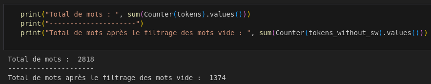 

J'ai au final 1374 mots non-unique, quantifiés dans un dictionnaire. Ceci est directement exploitable avec WordCloud.

Je réalise un masque de la silhouette de Nikola Tesla.  Cela me permet d'obtenir alors une sortie de nuage de mot déjà positionné sur la silhouette.

```python
mask = np.array(Image.open("tesla_max.jpg"))
img = mpimg.imread("tesla_max.jpg")
```


J'instancie le nuage de mot.

```python
words = " ".join(tokens_without_sw)
wc = WordCloud(background_color="white", max_words=50, stopwords=stop_words, min_font_size=30, max_font_size=100, collocations=False, mask=mask)

# Générer et afficher le nuage de mots
plt.figure(figsize= (30,15))
wc.generate(words)
plt.imshow(wc)
plt.show();
```

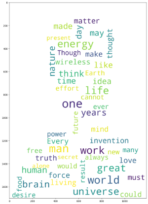

À ce stade, il ne me reste plus qu'à affiner les réglages de taille et quantité de mots, je peux alors générer autant de nuages de mots aléatoirement que je souhaite. Cela me permet d'en sélectionner un qui me plaît, avec des mots très forts de sens. Plus ils sont gros, plus ils sont statistiquement nombreux dans l'ensemble des citations et donc, plus **"importants"**.

```python
plt.figure(figsize= (30,30))
wc.generate(words)
plt.imshow(wc.recolor(color_func=ImageColorGenerator(mask)), interpolation="bilinear")
plt.axis("off")
plt.savefig('output.png')
```

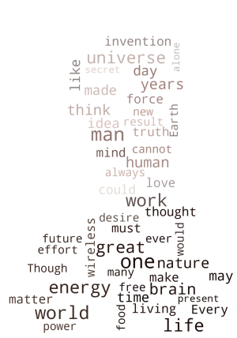

# Étape 2 : Vers la dimension  

Maintenant, nous allons devoir vectoriser la photo pour une meilleure précision et 
scalabilité, cette étape est entièrement réalisé avec Inkscape, pour travailler en SVG.

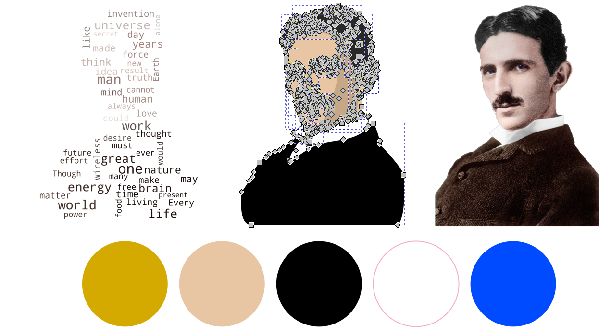

Il est important de noter que j'ai volontairement fixé le nombre de couleur à cinq. Ce choix sera expliqué dans l'étape suivante.

Je profite également de cette étape pour concevoir le cadre avec des éclairs (la maîtrise de l'électricité étant un détail très important de la vie de Nikola Tesla).

Je place tout en haut la signature officielle de Nikola Tesla en guise de nom ([le format SVG de cette dernière est disponible sur Wikipédia](https://commons.wikimedia.org/wiki/File:TeslaSignature.svg) puis tout en 
bas, ma citation favorite.

Enfin, je rajoute le nuage de mots par dessus, j'adapte ce dernier pour un meilleur rendu.

À ce stade, la conception 2D de l'œuvre est terminée, il est temps d'ajouter une nouvelle dimension.

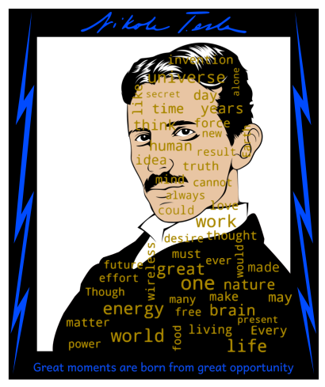

Nous basculons à présent sur l'outil Autodesk Fusion 360. Le SVG conçu précédemment peut être importé directement afin de le reproduire à l’identique avec des matériaux pour la couleur.


Chaque polygone est alors retravaillé ici pour définir sa distance sur l'axe Z, les textes sont les éléments les plus hauts sur cet axe, soit 10 mm. Le cadre en fond, lui, est de 4 mm.

Hélas, nous sommes dépendant de la méthode d'import du SVG de Fusion 360, ce qui  rend l'étape de conversion 2D vers la 3D très fastidieuse, mais avec de la persevérence, nous pouvons parvenir à nos fins.

<video id="tesla_010" controls preload="auto" width="600" height="350">
<source src="../../assets/tesla_010.mp4" type='video/mp4'>
</video>

# Étape 3 : De l'écran à la réalité

Le projet entièrement modélisé en 3D, il est temps de passer à la fabrication. Pour ceci, j'utilise une machine de pointe, la Prusa MK4 équipée du module MMU3 me permettant une impression avec 5 couleurs en simultanée. 

J'utilise donc des bobines de PLA avec les couleurs suivantes : blanche, noire, bleue, or (pour le texte) et ivoire (pour la peau).

L'export du fichier 3D depuis Fusion 360 s'effectue au format **3MF**, qui permet de travailler la découpe et le multicouleur, j'utilise pour ça Prusa Sclicer, bien entendu, ce dernier est configuré avec le profil de mon imprimante 3D et de ses 5 bobines.

Nous pouvons donc effectuer toute la colorisation, de nouveau, via l'outil peinture multi-matériaux du logiciel. Puis finalement, effectuer la configuration des paramètres d'impression, tel que la hauteur de couche, la vitesse, les supports, etc ...

<video id="tesla_011" controls preload="auto" width="600" height="350">
<source src="../../assets/tesla_011.mp4" type='video/mp4'>
</video>

Un point délicat à gérer, dû à l'utilisateur du multi-couleur, c'est la tour de purge, nécessaire pour nettoyer la couleur dans la buse entre chaque changement de couleur pour éviter un mélange des pigments. Hélas, cette dernière prend de la place, je parviens cependant à m'en sortir en modifiant les paramètres de cette dernière pour que celle-ci soit la plus longue et fine possible sur le côté du plateau. Je suis contraint néanmoins de réduire l'échelle de la pièce à 96 % de sa taille d'origine.

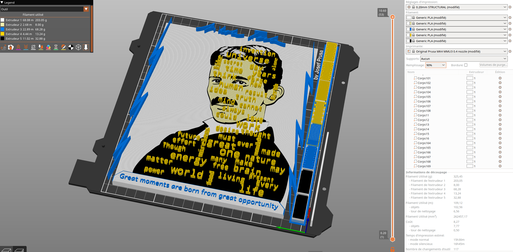

J'estime avoir fait au maximum des capacités de mon matériel. Même s'il est théoriquement possible de fabriquer en plusieurs parties, je tiens à éviter cela, pour éviter de créer des jointures visibles très inélégantes.

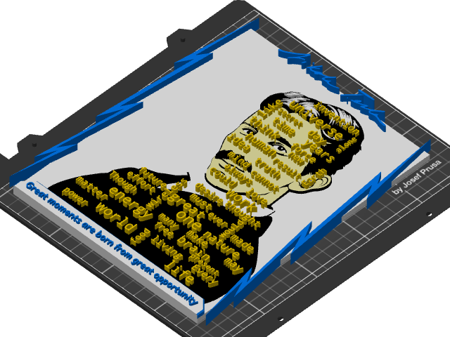

Ces étapes de découpe sont souvent effectuée au ressenti et selon l'expérience que nous avons en matière d'impression 3D, l'echec est toujours envisageable. Ce qui coûte malhereusement de la ressource. Il faut alors doser le risque, le coût de l'echec et le temps. Dans mon cas, je mise donc sur une impression la plus fine et la plus lente possible et un risque de décrochage minimum en sécurisant autant que possible. Cette stratégie est couteuse en temps et en ressources, mais diminue énormément le taux d'echec.

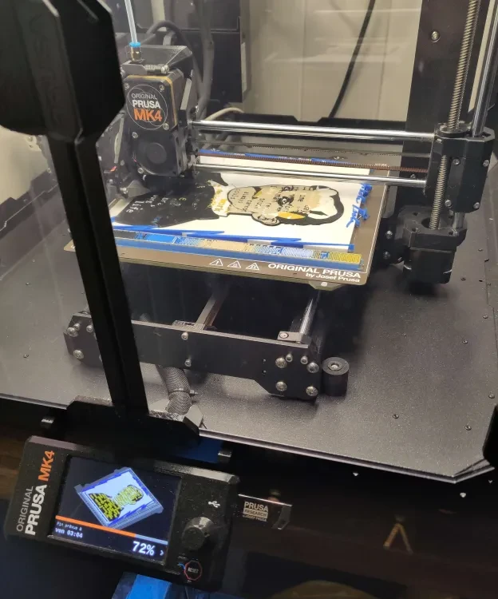

Une fois l'impression terminée avec succès, nous pouvons finaliser le projet avec du post-traitement, afin de nettoyer et réaliser des finitions, j'utilise pour ceci quelques produits (IPA et Cyanoacrylate), un pistolet thermique et un scalpel.

Voici les détails techniques calculés :

* Poids : 330g
* Taille : 230mm x 200mm X 10mm
* Temps de réalisation :  50 heures
* Temps d'impression : 16 heures
* Fabriqué en un seul exemplaire unique au monde

Je rajouterais probablement une plaque de verre utlérieument si j'ai l'occasion de m'en procurer une, pour proteger le tout. En attendant, voici une vidéo du résultat final !

<video id="tesla_art" controls preload="auto" width="600" height="350">
<source src="../../assets/tesla_art.mp4" type='video/mp4'>
</video>