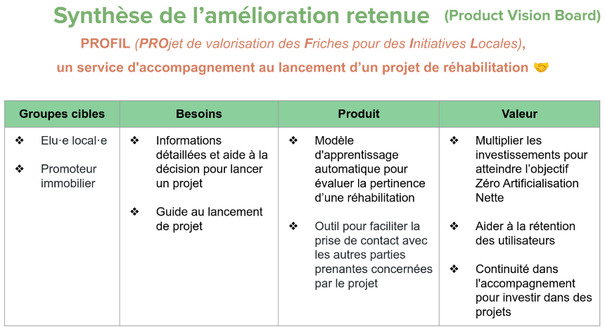
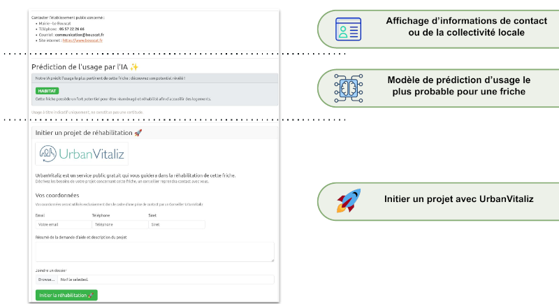
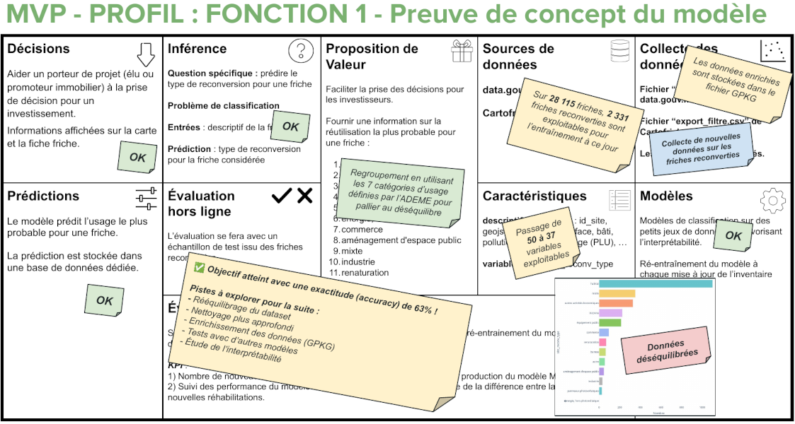

Title: Innover par le traitement de la donnée pour le Service Public
Category: Informatique
Tags: ia, cartographie, projet, analyse
Date: 2025-07-23
Status: published

# Retour d'expérience avec Cartofriches, de la théorie à la réalité 🫴

L'IA s'accélère à une vitesse fulgurante, le fossé entre les fantasmes qui entourent ses capacités et la réalité tangible d'une mise en production concrète reste considérable. C'est précisément cette disparité, bien éloignée de l'idéal théorique, à laquelle notre équipe a fait face à travers notre projet ambitieux : l'amélioration du dispositif [Cartofriches](https://cartofriches.cerema.fr) pour le compte du CEREMA, un outil de service public crucial pour l'identification et la valorisation des friches.

En nous immergeant dans les complexités opérationnelles de [Cartofriches](https://cartofriches.cerema.fr), notre projet a eu pour but de combler ce fossé, démontrant comment le traitement pratique de la donnée peut véritablement transformer les services publics, passant de la théorie à une réalité concrète.

# Conception du produit 🦾

La conception de notre produit, baptisé [PROFIL](https://github.com/heuzef/cartofriches/tree/PROFIL/profil), a été guidée par une approche structurée et itérative, visant à répondre efficacement aux besoins identifiés dans le cadre du projet. Notre objectif était de créer un service d'accompagnement au lancement de projets de réhabilitation de friches fonctionnalité actuellement limitée à un simple lien vers le site [UrbanVitaliz](https://urbanvitaliz.fr).

## Vision

Notre démarche a commencé par l'élaboration d'un PVB[^1], un outil stratégique qui nous a permis de définir clairement : 

* les Persona cibles
* les besoins à couvrir
* l'objectif du produit
* la valeur ajoutée générée par le produit

Pour répondre aux besoins identifiés, nous avons envisagé plusieurs solutions et associé à chacune des indicateurs clés de performance (KPI) spécifiques.

Les valeurs portées par notre produit incluent la multiplication des investissements pour atteindre l'objectif européen [ZAN 2050](https://www.ecologie.gouv.fr/politiques-publiques/artificialisation-sols), l'aide à la rétention des utilisateurs et la continuité dans l'accompagnement pour investir dans des projets durables.

## Analyse fonctionnelle et développement du PoC[^2]

Suite à l'élaboration du PVB, nous avons mené une analyse fonctionnelle approfondie, pour donner naissance à trois fonctionnalités orientées data.

Nous débutons l'élaboration d'un PoC[^2], étape cruciale dans le développement de notre produit, car il nous permet de valider nos hypothèses et de démontrer la faisabilité technique de notre solution. 

Pour illustrer, voici une démo vidéo de notre PoC[^2]. 

<video id="cartofriches_004.mp4" controls preload="auto" width="900" height="500">
<source src="../../assets/cartofriches_004.mp4" type='video/mp4'>
</video>

_Montre l’état d’une “Fiche Friche” actuellement sur [Cartofriches](https://cartofriches.cerema.fr), puis notre PoC[^2] équivalent revisité (Avant / Après)._

C’est souvent durant cette partie d’un projet Data que la dure réalitée nous rattrape : _“Qu’avons-nous comme données ? Que souhaitons-nous vraiment obtenir et pour quoi ?”_

Cette étape est anxiogène car nous devons placer le curseur entre les fantasmes et la réalité. Se mettre au défi avec de grandes ambitions est très stimulant, mais cela à un coût et des enjeux ayant un impact immense, il faut faire preuve d’une grande communication avec son équipe afin de définir la bonne stratégie.

Dans cet article, afin d’éviter que ce dernier ne soit trop dense, nous aborderons uniquement la phase conception de la fonctionnalité liée à l’IA.

## Modèle de prédiction d’usage le plus probable pour une friche

### Analyses rapides

Notre démarche a commencé par des analyses rapides des données disponibles (EDA[^3]).

Ces analyses nous ont permis d'obtenir une première idée de ce qui était réalisable. Nous avons alors envisagé un modèle de machine learning simple de catégorisation capable de déterminer la popularité d'une friche sans projet en se basant sur les reconversions de friches similaires.

Grâce à cette EDA[^3], nous avions suffisamment d'éléments pour être rassurés sur la faisabilité de cette approche.

Cependant, cette première idée s'est rapidement heurtée à la réalité des besoins de notre fonction. En effet, cette approche, bien que réalisable, n'était pas assez ambitieuse et pouvait même être contre-productive. Elle risquait en effet de démotiver les porteurs de projets, ce qui était l'effet inverse de notre objectif initial.

### Conception d'un Canevas de machine learning

Face à cette limitation, nous avons décidé de partir sur la conception d'un canevas de machine learning plus sophistiqué. Ce canevas nous a permis d'imaginer un modèle de régression linéaire beaucoup plus adapté à nos besoins. Cependant, cette approche idéale s'est rapidement révélée irréalisable en raison d'un manque cruel de données et de métriques d'évaluation fantasmagoriques.

Cette prise de conscience a été un coup dur pour l'équipe. Les nombreuses heures de réflexion et de travail ont semblé vaines, et des divergences sont apparues au sein de l'équipe vis-à-vis des directions stratégiques à prendre. Ce fut une période difficile, mais nous avons su tirer des leçons précieuses de cette expérience.

### Persévérance et solution réaliste

À force de persévérance, nous avons finalement trouvé une solution réalisable en théorie, qui plaçait le curseur entre le modèle trop simple et inutile et celui trop ambitieux et irréalisable. Cette solution représentait un compromis satisfaisant, aligné sur une vision globale partagée par toute l'équipe. Notre nouveau modèle s'appuyait sur de la catégorisation, ayant pour objectif de prédire le cas d'usage le plus probable d'une friche sans projet.

Cette avancée a été une véritable délivrance pour l'équipe. Nous étions enfin tous alignés sur une vision commune et satisfaits de ce que nous pourrions produire comme modèle à ce stade. Cette solution était à la fois réalisable et pleine de sens, et notre persévérance ainsi qu'un travail de réflexion commune nous ont permis de surmonter cette mauvaise passe. Et ceci, nous le devons **à la force de notre communication**, qui prévaut sur toutes les méthodes et outils du monde.

### Développement d'un nouveau PoC[^3]

Remotivés et convaincus par cette nouvelle approche, nous avons décidé de nous lancer dans le développement d'un nouveau PoC[^3]. Pour nous assurer de la faisabilité de notre modèle, nous avions un objectif très humble : atteindre une exactitude de 60% sur nos prédictions. Cependant, nous avions un énorme obstacle à surmonter : **nous étions à 96 heures de la remise du projet**.

Ce délai serré s'explique par le fait qu'il n'était pas attendu de notre part un PoC, mais nous y tenons fermement. Pour nous, c'était un moyen infaillible de démontrer nos propos en développant une IA qui fonctionne pour de vrai. Nous avons donc organisé un hackathon improvisé pour relever ce défi.  Épuisés par les longues heures de travail et sans attentes particulières, nous n'espérons pas accomplir de miracle en si peu de temps. Cependant, nous étions déterminés à donner le meilleur de nous-mêmes pour atteindre notre objectif.

### Premiers jets

Nos premiers essais furent très décourageants, avec des scores avoisinant les 43% d’exactitude. Ces résultats ont mis en lumière de nombreux problèmes dans les données disponibles que nous n'avions pas identifiées lors de notre première analyse sommaire. Nous avons rapidement réalisé que nous devions organiser notre travail de manière plus efficace pour maximiser nos chances de succès.

### Organisation du travail

Nous avons décidé de diviser les tâches entre nous trois de manière à couvrir tous les aspects essentiels du développement du PoC[^3] :

1. [Rova](https://www.linkedin.com/in/rova-ralaimidona) s'est occupé de l'analyse des données, une tâche cruciale sur laquelle reposerait tous nos travaux. Son travail a été très conséquent et a posé les bases de notre compréhension des données disponibles. _(Le chapitre ci-dessous est consacré à la présentation de son analyse des données)._
2. Moi-même, je me suis chargé du prétraitement du jeu de données brut à notre disposition. Étant donné le temps extrêmement réduit, j'ai dû procéder à un nettoyage très rapide, en prenant des décisions basées sur l'intuition dans l'espoir d'augmenter la qualité des données. C'était à la fois enrichissant de voir que nous pouvions accomplir autant en si peu de temps, et frustrant de réduire autant la qualité de notre travail par manque de temps. Cependant, l'objectif de ce PoC était bien d'obtenir un résultat minimum le plus vite possible.  
3. Enfin, [Frédéric](https://www.linkedin.com/in/frederic-vincent-saurel) s'est occupé de récupérer mes données prétraitées pour se concentrer sur l'entraînement et l'évaluation des modèles. Les expérimentations portaient sur deux algorithmes basés sur des méthodes d'ensembles.

Ce mode de fonctionnement s'est avéré diablement efficace, chacun ayant une partie essentielle et clairement définie que nous pouvions faire avancer en parallèle.

### Collaboration et progrès

Frédéric et moi nous actualisons régulièrement le rapport d'analyse des données de Rova pour nous appuyer sur ses travaux. D'heure en heure, nous avions une vision de plus en plus claire des données de [Cartofriches](https://cartofriches.cerema.fr), des actions plus évidentes à mener et des solutions plus pertinentes pour franchir les obstacles.

De mon côté, j'apportais des données Silver régulièrement via Git sur lesquelles Frédéric s'appuyait pour ses entraînements. À chaque commit, le jeu de données utilisé était théoriquement de meilleure qualité, et je pouvais relancer les scripts d'entraînement sans me poser de question pour obtenir les métriques et constater les gains obtenus. Chaque pourcentage gagné était une victoire.

Frédéric, de son côté, était focalisé sur l'amélioration continue de l'entraînement et de l'évaluation, en jonglant avec deux algorithmes en parallèle. Nous étions en surchauffe, mais c'était vraiment passionnant.

### Résultats

Finalement, au petit matin de la veille de la réunion, nous avons obtenu un score très décevant avoisinant les 50%. C'était vraiment frustrant de ne pas avoir atteint l'objectif visé après autant d'efforts, mais c'est la réalité qui se cache derrière la conception des IA.

Nous nous résignons alors à mettre à plat nos travaux incomplets, démontrant que notre PoC[^3] n'était clairement pas au point. C'était sans compter sur Frédéric, reposé, qui n'a pas voulu lâcher le morceau jusqu'au dernier moment. Il a tenté une manipulation assez osée pour pallier le plus gros problème de déséquilibre dans nos données, en ré-ajustant nos objectifs initiaux (sans en changer le but) et en testant avec un algorithme tout à fait nouveau. Foutu pour foutu … 🙂

 **🤯 Et c'est à une heure de notre réunion pour rendre nos travaux que nous avons obtenu le score de 63%. Victoire ! 🤯**

Difficile à réaliser sur le coup, mais nous avons ajusté en urgence notre rapport, car cela changeait complètement la donne : nous venions de démontrer que ce modèle était réalisable. Notre exploit n'a pas manqué de sidérer les acteurs durant la réunion, et nous étions très fiers de ce que nous venions d'accomplir.

## Processus de lancement et mise en production

La conception de [PROFIL](https://github.com/heuzef/cartofriches/tree/PROFIL/profil) ne se limite pas au développement technique. Nous avons également prévu un processus de lancement complet pour assurer la mise en production réussie de notre service. 

Ce processus inclut plusieurs étapes clés, qu’il est important d’étudier et de prendre en compte au plus tôt dans le projet. Nous pouvons citer par exemple : Calcul des coûts, Développement des fonctionnalités, Intégration et automatisation, Documentation, Tests et déploiements, Démos et retours, Plan de communication, Prévoir des mécanismes de maintenance, de supervision et de suivi des KPI, etc …

Ce processus complet nous permettra de garantir la réussite de notre projet et de répondre efficacement aux besoins des porteurs de projets de réhabilitation de friches.

👉 [Accès au dépôt Git du projet PROFIL](https://github.com/heuzef/cartofriches)

Je vous relais maintenant les notes de Rova, qui présente en détail la partie concernant le précieux audit de la qualité des données.

----

> L'article ci-dessous, rédigé par [Rova Ralaimidona](https://www.linkedin.com/in/rova-ralaimidona), date de Juillet 2025.

# L'analyse et le traitement des données 📊

## Synthèse

Ce rapport présente une synthèse de l’audit qualité des données de [Cartofriches](https://cartofriches.cerema.fr), réalisé en juin 2025\. L’objectif principal de cette étude est d’évaluer la qualité des données agrégées au sein de la base, afin d’en analyser l’impact sur les usages métier – en particulier pour les décideurs publics et les chargés d’études mobilisés dans la réutilisation ou la reconversion des friches, ainsi que dans leur identification.

L’étude poursuit un double objectif : **Évaluer la qualité des données** et **Initier une lecture métier structurée.**

###  Contexte et approche méthodologique

Dans le cadre d'un audit qualitatif, les données ont été structurées en huit domaines métiers définis selon une logique fonctionnelle : Informations générales, Temporelles, Localisation, Périmètre, Partenariat, Financement, Modalités, et Pilotage. Ce regroupement vise à faciliter l'analyse des variables selon leur usage opérationnel et stratégique. Chaque domaine a fait l'objet d'une évaluation centrée sur la complétude, la cohérence interne, la normalisation des formats, et la pertinence des informations.

### Diagnostic transversal : principaux constats

* **Données essentielles incomplètes.** De nombreuses variables-clés sont frappées par un taux de non-renseignement élevé. C’est le cas, par exemple, du nom de l’établissement dans le domaine "Informations générales", ou encore des dates de début et de fin dans le bloc "Temporel". Cette absence rend difficile l’exploitation des données pour des analyses longitudinales ou des croisements inter-domaines.

* **Hétérogénéité des formats.** La variabilité des formats (dates, localisations, dénominations) génère des incohérences systémiques. Par exemple, les localisations oscillent entre mentions de départements, communes, codes postaux, ou formules libres, sans contrôle de validation. Cette variabilité nuit à la lecture cartographique ou à l’agrégation multi-niveaux.

* **Redondances et contradictions.** Plusieurs cas relèvent d'incohérences logiques (date de fin sans date de début, champs exclusifs renseignés simultanément). Ces contradictions rendent certaines observations inexploitables ou faussent les analyses automatiques.

* **Structures conceptuelles confuses.** Dans le domaine *Périmètre*, certaines variables entretiennent une confusion entre différentes logiques : champ d’intervention, public cible, et thématique d’action. Cette absence de distinction conceptuelle nuit à la lisibilité fonctionnelle du domaine et à la réutilisabilité des données.

Par exemple, lors des études préliminaires, une ambiguïté récurrente concerne la distinction entre *producteurs* et *sources* de données. Cette confusion, présente dès la collecte, complexifie en aval l’interprétation des périmètres de responsabilité ou de légitimité, et nuit à l’identification claire des circuits de données.

### Recommandations stratégiques

* **Standardiser et contraindre les formats.** L’adoption de listes déroulantes, champs fermés, ou règles de validation à la saisie permettrait de fiabiliser les données en amont. Les localisations, les dates et les noms d'entités doivent être encadrés par des référentiels communs.

* **Clarifier la structure des variables.** Une revue métier des domaines tels que "Périmètre" est nécessaire pour distinguer les logiques d’analyse (thématique vs. cible vs. mode d’intervention) et redéfinir les variables de façon non ambigüe.

* **Déployer un pilotage de la qualité des données.** Un tableau de bord qualitatif par domaine, avec seuils d’alerte, doit être mis en place. Il pourra s’adosser à des revues périodiques de cohérence et complétude.

* **Accompagner les contributeurs.** Un guide de saisie unifié, associé à des sessions de formation ou de sensibilisation, permettra de réduire les erreurs humaines et de diffuser une culture commune de la donnée fiable.

## Conclusion

Cette analyse confirme la pertinence du découpage par domaines métiers pour identifier les points de fragilité structurelle des données. 

Elle met en lumière l’urgence d’une action coordonnée sur les standards de saisie, la clarification des modèles conceptuels, et la gouvernance de la qualité. 

L’objectif n’est pas seulement technique : il s’agit de renforcer la fiabilité de l’information comme support de pilotage, d’aide à la décision et de redevabilité des dispositifs observés. 

Par ailleurs, ce travail a facilité la préparation d’une phase de modélisation par apprentissage automatique. Le regroupement des variables en domaines cohérents a permis de cibler des agrégations pertinentes, tout en simplifiant l’architecture du modèle et en réduisant l’impact des déséquilibres entre classes.

👉 [Lire le rapport interactif](https://hagatiana.github.io/cartofriches/data_quality_cartofriches.html)

[^1]: Product Vision Board
[^2]: Proof of Concept
[^3]: Exploratory Data Analysis