Title: Fabriquer son clavier mécanique sur mesure
Category: Informatique
Tags: clavier, diy
Date: 2025-01-04
Status: published

Si vous passez une grande partie de votre vie derrière un écran, vous avez probablement déjà investi dans un clavier haut de gamme et vous ne regrettez certainement pas l'achat de ce périphérique très important.

Je vous propose d'aller encore plus loin dans cette logique en fabriquant votre propre clavier sur mesure, le temps et l'argent que cela demande est largement compensée par le gain en confort et productivité que cela vous apportera. De plus, le petit bijou que vous aller allez fabriquer sera unique pour vous, vraiment durable, évolutif et facile à l’entretient.

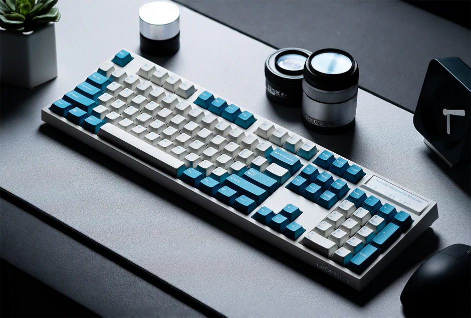

Pensez-y sérieusement, pour votre prochain clavier : **fabriquez-le !** Je vous rassure, c'est simple et agréable, un peu comme fabriquer son propre PC.

Nous allons donc passer en revue toutes les étapes à suivre dans l'ordre pour obtenir le clavier ultime de vos rêves et pour la vie.

# Mais combien ça va me coûter !? 🧐

Bonne nouvelle, ça dépend de vous, même si le but du projet, c'est d'y investir plus cher que pour un clavier de luxe, il faut savoir que certaines marque, comme par exemple les filous de chez Razer, vendent des claviers à 350€, pour une durée de vie misérable, alors bon ...
Pour ce projet, je vous recommande d'envisager une enveloppe de 300€ à 500€, vous aviserez ensuite selon vos ambitions, car il est facile de se laisser tenter pour se faire plaisir 🤗

# Deux types de clavier ⌨️
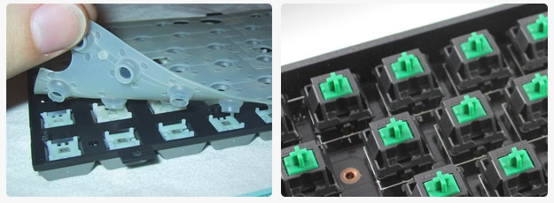

Il est important de bien comprendre que les vrais claviers historiques, sont mécaniques. Car il existe également des clavier plus récent, de bien moindre qualité et donc moins cher, que nous retrouvons assez fréquemment : les claviers à membrane.

## Clavier à membrane
Comme le nom l'indique, ce clavier dispose d'une membrane en silicone pour la pression, il est donc :

* Économique (prix moyen 15€)
* Capable d'encaisser des accidents de café (le silicone étanche "protége" des liquides).
* Silencieux

Simple et efficace, adapté pour de la bureautique, ce type de clavier jetable est particulièrement médiocre et dispose d'une durée de vie de quelques années tout au plus.
Certaines marque peux scrupuleuses ne vont pas hésiter à vendre ce type de clavier plusieurs centaines d'euros, ne vous faites plus avoir.

## Clavier mécanique
Bénéficie d'une vitesse de frappe rapide, fluide, précise et peuvent bénéficier de toutes les qualités imaginables et s'absoudre de tout les défauts. Son prix est élevé.

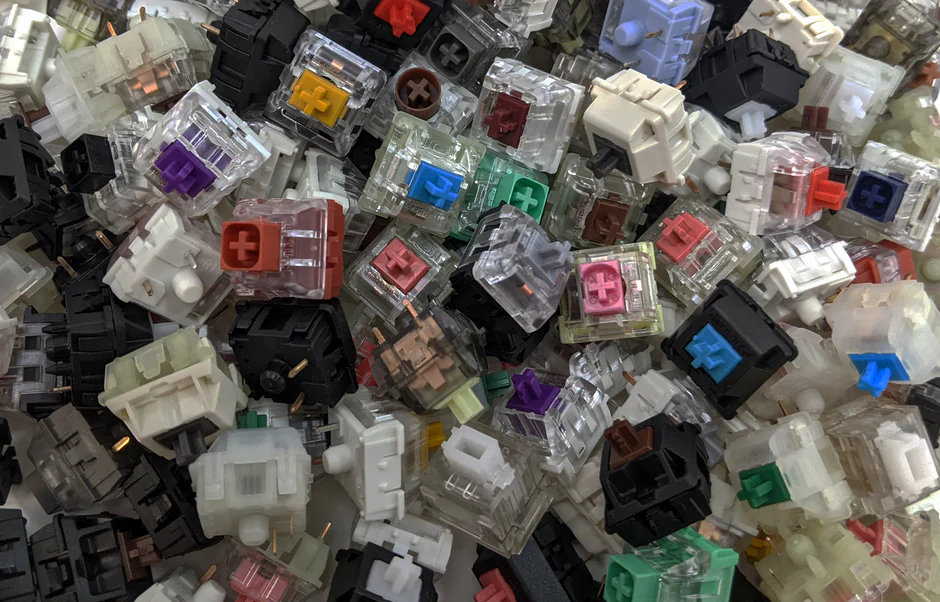

## Le choix est  donc simple
Si vous n'êtes pas prêt à mettre la main au portefeuille, procurez-vous un clavier à membrane en grande surface, sinon, nous allons pouvoir commencer à jouer dans la cours des grands 🤓

# Composants d'un clavier ⚙️

Un clavier, c'est plutôt simple, nous avons  :

* Une carte PCB, le cœur du clavier, dans un châssis.
* Le châssis lui-même est en deux parties : inférieur et supérieur dans lequel nous retrouverons une plaque qui accueille les touches.
* Les touches se décomposent en deux parties :
	* les switchs (commutateurs)
	* les keycaps (capuchons)

Voilà, il vous suffira donc de concentrer vos choix sur ces composants. Mais vous allez voir, que nous avons l'embarras du choix justement !

# La mise en page et la norme 🔎

Commençons par le plus important : décider du layout que vous souhaitez, il s'agit de la taille et forme de votre clavier. Puis enfin le format, qui est défini par une norme.

## Layout (Mise en page)

Concernant le layout, le standard est le 100%, soit la taille offrant un pavé numérique complet, une rangée de fonctions et un cluster de navigation. C'est le format le plus grand et le plus historique.

Si votre but est d'avoir le clavier le plus complet, alors le 100% est fait pour vous. Plus que 100%, est théoriquement possible avec l'ajout de modules supplémentaire au clavier.

Ensuite, il est possible de rendre le clavier plus compact en supprimant des touches.

80% ou TKL (Tenkeyless) supprime le pavé numérique. C'est un layout très populaire.

40%, c'est le plus petit, si vous cherchez du ultra-compact. Sous les 40%, ce sont des Macropad.

Et bien entendu, il existe toute une multitude de layout entre 100% et 40%, pour répondre à votre besoin.

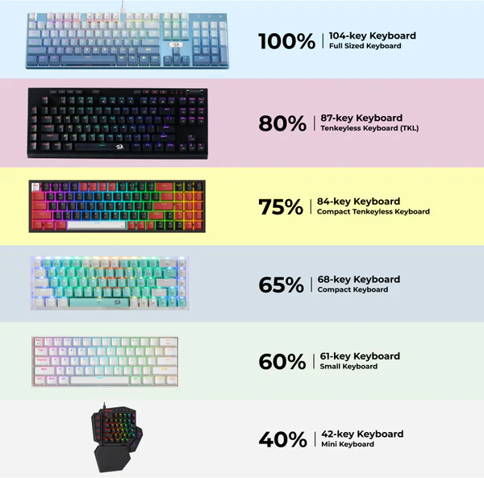

## Format (Norme)

La norme **ISO** est la plus rependue, car internationale, c’est sûrement ce type de clavier que vous avez l’habitude d’utiliser. Mais il existe également une norme américaine **ANSI**. La différence n’est pas évidente de prime abord. Mais il existe des nuances bien réelles qui les distinguent avec leurs avantages et inconvénients :

* Le nombre de touches varie, cinq sont concernées.
* Sur un clavier **ISO**, la touche *ENTER* est large, alors que sur un format **ANSI**, il n’apparaît que sur une seule.
* La touche *Shift* gauche est plus large sur les claviers **ANSI**. Supprimant donc une touche.

Voici une image pour visualiser les différences :

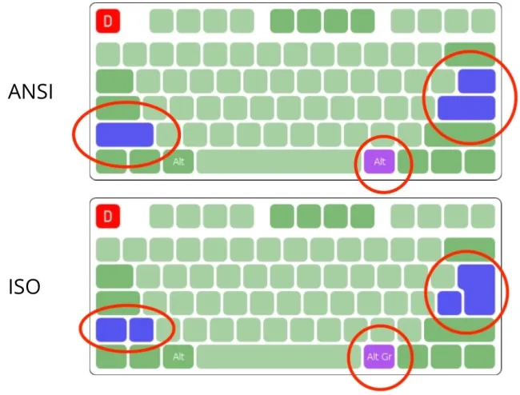

Les nuances entre ces 2 normes sont importantes et je vous recommande de tester les deux claviers pendant un temps pour conforter dans votre choix.

> Pour ma part, j'ai banni le ANSI, car j'avais tendance à appuyer sur ``ENTER + *`` pour simplement appuyer sur ``ENTER``. Ce qui a été fatal, le jour, où j'ai saisi une commande de suppression dans un terminal Linux, (les adeptes du ``rm *`` comprendrons ma douleur). Cependant, certains n'aiment pas avoir une grande touche entrée. Bref, il faut tester les deux.

# L'agencement 🌐

Pour terminer, il est important de choisir un agencement pour notre clavier. Cette étape pourra être très facilement modifiée grâce au principe des Keycaps. Mais bon, il faut bien commencer par un agencement.

Si vous êtes Français, vous allez très sûrement opter pour du classique **AZERTY** ou éventuellement du **QWERTY** si vous êtes habitué au clavier anglophone.

Sachez juste pour votre culture, que ces deux agencements sont très mauvais et non optimaux pour la vitesse et le confort de frappe. Ils se sont juste trop imposés pour être remplacés …

Si cela vous intéresse, l’équivalent le plus optimal de l’**AZERTY** est le **BÉPO**. Et l’équivalent du **QWERTY** est le **DVORAK**.

Si vous êtes un guerrier prêt à réapprendre à taper au clavier, vous pouvez envisager ces agencements pour un **gain monumental de confort et vitesse de frappe**.

# Où en somme-nous ? 🥵

Nous avons donc décidé le Layout, le format et l'agencement. Nous allons donc pouvoir commencer à regarder autour des constructeurs ce qu'ils nous proposent. Pour ma part, je vous recommande [Keychron](https://keychron.fr), car j'ai une expérience parfaite avec eux. De plus, ils ont introduit un concept de retroéclairage par la face sud (South facing RGB), permettant de s'équiper de keycaps avec des symboles sur le côté.

Libre à vous de fouiller chez la concurrence pour comparer. Le plus important et de garder à l’esprit que vous cherchez un fabricant sérieux, capable de vous fournir :

* Un clavier mécanique entièrement démontable.
* Le PCB et le châssis peuvent être achetés séparément.
* Possible d’acheter les pièces en kit pour monter le clavier soit même.
* Offre de nombreux accessoires et pièces dans sa boutique.

> Découvrir d'autres marques sur [https://mechanicalkeyboards.com/pages/brands](https://mechanicalkeyboards.com/pages/brands)

L'objectif est de gagner en résilience pour être autonome sur l'évolution et l'entretient de la bête.
 Pour cela, le clavier devra **obligatoirement** bénéficier du **HOT-SWAP** pour vous permettre de disposer les switchs comme bon vous semble. Si le clavier ne permet pas ça, c'est éliminatoire.

Vous pouvez également envisager que le clavier soit compatible **QMK et VIA**. En  effet, si vous souhaitez aller très loin dans la personnalisation des touches de votre clavier, c'est pertinent. Ce firmware Open-Source s'impose comme un standard des claviers mécaniques de plus en plus.

C’est bon, vous avez trouvé le modèle de vos rêves, nous allons maintenons commencer à le pimper !

# Personalisation 🖌️

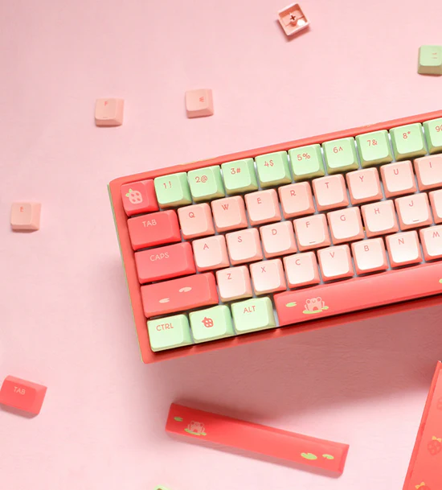

La couleur du châssis, les matériaux, le retroéclairage et si vous souhaitez du sans-fil. Gardez à l’esprit que ces choix sont généralement définitifs, car coûteux à changer, ainsi, je vous recommande de partir sur quelque chose de durable et intemporelle : un châssis en métal et en filaire (pas de problème d'usure ni de batterie). Mais c’est strictement personnel comme décision.

Il est temps de concevoir vos touches maintenant !

## Les Switchs (Commutateurs)

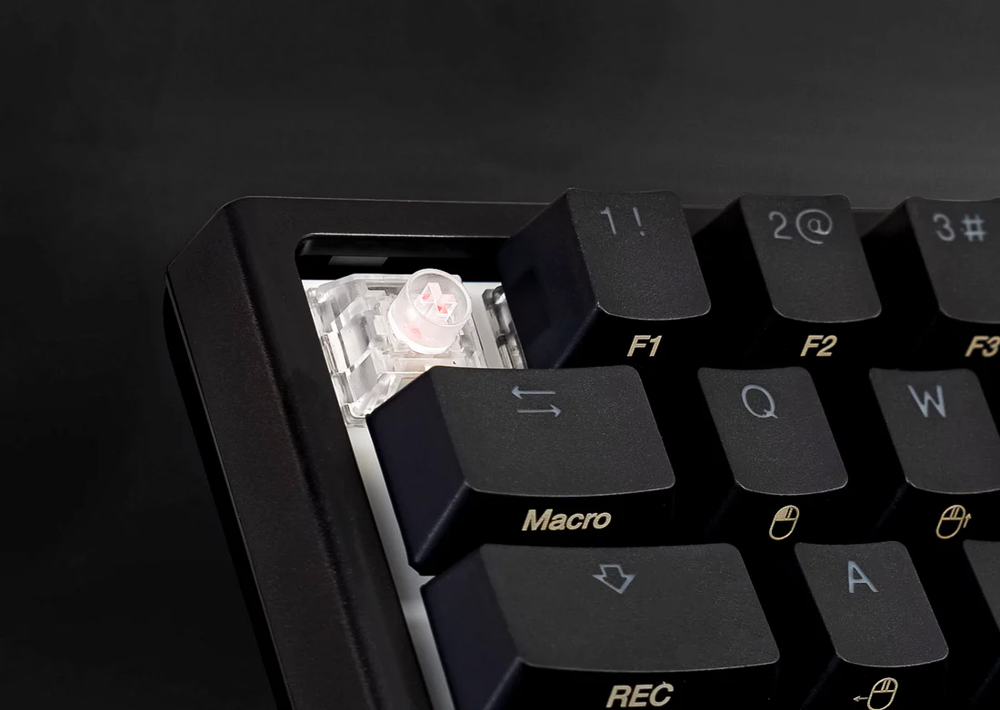

Si vous avez bien pris soin de vous assurer que votre clavier est compatible **Hot-Swap**, cela signifie que chaque touche peut être remplacée à chaud.
C'est-à-dire, il vous est possible de changer le switch, qui correspond a la mécanique d'un bouton avec un simple extracteur.

Il existe ainsi de nombreux types de switch ayant des effets et sensation bien différente, ainsi que plusieurs fabricants. Le plus connu et servant de standard sont **Cherry MX**, car ce sont les pionniers. Cependant, il existe aussi des alternatives populaires comme **Gateron**, leur gamme et tarifs sont plus abordable. **Kailh**, qui eux vont plutôt chercher à vendre de la haute qualité innovante. **Outemu**, fabricant chinois avec des prix agressifs et d'autres marques plus spécialisées (**TTC, Tealios, Holy Panda, ...**).

Ces fabricants peuvent proposer des centaines de types de Switch diversifiant alors la sensation de frappe, la durabilité, les matériaux, les tendances et innovation, ...

Ce qui est interessant ici, c'est qu'un Switch équivaudra de façon universel à une touche de votre clavier, peut importe la marque ou la touche, c'est pour cela que l'on à tendance à acheter des boites de switch pour avoir un petit stock et de la variété, surtout si vous souhaitez utilisez plusieurs type de switch pour votre clavier, ce que je vous recommande! Faites vous plaisir !

Voici les 4 catégories communes à tous les switchs :

* **Tactile** *(classique et infaillible)* : désigne un interrupteur doté d’une bosse physique et sensorielle pendant la frappe, ce qui vous donne la tranquillité d’esprit subconsciente pendant que vous tapez, sachant que vos frappes sont enregistrées.

* **Linéaire** *(vite vite !)* : désigne un interrupteur sans bosse tactile. Un interrupteur linéaire est souvent privilégié par les joueurs, en particulier pour les jeux nécessitant une saisie éclair.

* **Cliquable** *(CLIC CLIC !)* : signifie exactement ce que cela signifie. Ce type d’interrupteur est connu pour son bruit **“CLICKY !”** fort et audible, pendant que vous tapez. Similaire aux interrupteurs que l’on trouve sur un clavier d’ordinateur vintage ou une machine à écrire. Adoré par les dactylos et détesté par les personnes dans le même bureau que vous.

* **Silencieux** *(chuuut …)* : conçus pour minimiser le bruit produit pendant la frappe. Ils sont généralement dotés d’un matériau souple qui atténue le bruit de l’actionnement de l’interrupteur et de son appui, ce qui les rend idéaux pour les environnements de bureau ou les espaces partagés.

Mais comment savoir quel type de Switch choisir dans ce cas ! Facile de s’y perdre en effet. Et bien la réponse est simple : il vous faut vous procurer des **testeurs de switch**.

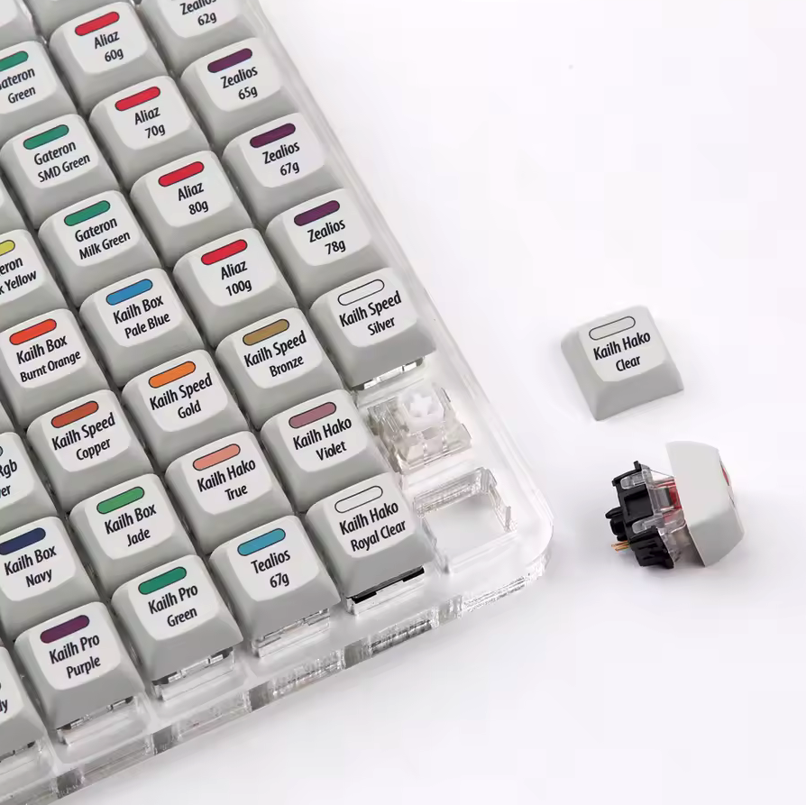

En général, les testeurs de switch comprennent une dizaine de switchs d’une marque et il est possible d'en avoir qui offrent une centaine de touches. Les prix varient en moyenne entre 10€ et 50€ pour des versions sans Keycaps.

Le problème ici, c'est qu'il est assez important de prendre son temps pour tester un maximum de switch possible et de plusieurs marque. Je me suis surpris à tapoter des testeurs pendant 1h et aller jusqu'à prendre des notes pour chaque touche tant l'expérience est intéressante pour trouver la sensation idéal pour nous. Ainsi, dans le meilleur des mondes, nous avons tout un tas de grands testeurs pour chacune des marques, ce qui revient à plusieurs centaines d'euros pour juste choisir pour finalement les mettre aux placards … Ou alors vous êtes copains avec un geek qui possède déjà un stock de testeurs.

Pas simple, mais je vais être honnête, je vous conseille d'éviter de limiter votre expérience de choix à un petit testeur de 9 touches. Certaines personnes font des vidéos de test, mais cela ne reflétera pas votre expérience avec les touches.

Je vous laisse discuter avec votre portefeuille à ce stade.

## Les Keycaps (Capuchons)

Dernière étape, les Keycaps, là, c'est juste l'éclate sur la personnalisation !

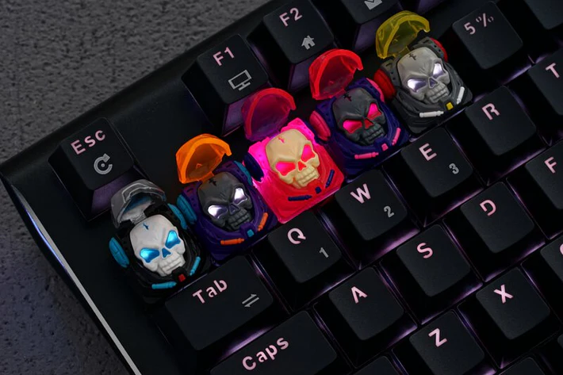

Quelques infos techniques :

* Le matériau le plus commun est le **PBT**, mais tous est possible (ABS, résine, bois, marbre, céramique, laiton, titane, or massif, ...)
* La plupart des Switchs utilisent une potence "compatible Cherry MX" (littéralement c'est une croix), mais toujours vérifier avant d'acheter vos keycaps pour ne pas vous faire avoir.
* Les keycaps sont divisées 4 profils (R1, R2, R3 et R4).
* Il existe plusieurs familles de profils.

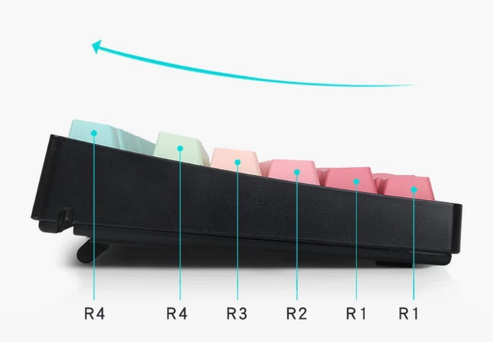

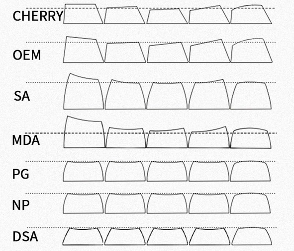

Un ensemble complet de touche personnalisées de qualité coûte dans les 50€ en moyenne. Il est possible sûrement de trouver des claviers mécanique d’occasion ou en vide-grenier pour récupérer les keycaps (voir avec les switchs si vous êtes chanceux) pour pas chère.

Finalement, il est possible de trouver des artistes très talentueux qui fabriquent de véritables œuvres d’art qui videront votre compte en banque :  [https://www.etsy.com/fr/search?q=capuchons%20de%20clavier](https://www.etsy.com/fr/search?q=capuchons%20de%20clavier)

<video id="tesla_art" controls preload="auto" width="900" height="500">
<source src="../../assets/keyboard_014.mp4" type='video/mp4'>
</video>

> PS : n'oubliez pas de vous procurer des stabilisateurs pour les grandes touches ! C'est essentiel pour aider à répartir le poids de chaque pression sur toute la touche et il maintient l'équilibre des touches plus grandes pour réduire les oscillations.

---

# Bonus : Fabriquer ses keycaps ❤️‍🔥

Si vous êtes motivés, voici comment procéder.

Vous aurez besoin d'être à l'aise avec **Inkscape** pour concevoir vos motifs au format **SVG**. Pour cela, l'entreprise WASD a mis à disposition des templates prêt à l'emploi.

Je partage les fichiers ici, car leur site ne me semble pas très pérenne : [ *keyboard_templates.zip*](../../assets/keyboard_templates.zip)

Si vous n'êtes pas inspiré, [SVG Repo](https://www.svgrepo.com) vous dépannera.

Imprimez vos motifs sur du papier de sublimation. Si vous ne souhaitez pas investir dans ce type d’imprimante spécial,  [certaines personnes proposent un service d'impression sur ce papier spécial](https://www.etsy.com/fr/search?q=Impression%20sublimation%20A4). **Attention, vos motifs doivent être imprimés en miroir sur le papier !**

Procurez-vous des Keycaps vierges, il en existe pas mal sur [Aliexpress](https://fr.aliexpress.com/w/wholesale-blank-keycaps-PBT.html). Faites attention de bien choisir du **PBT**.

Finalement, pour le transfert, vous devez presser à chaud le papier de sublimation sur une touche vierge pendant quelques secondes.

Pour cela, une machine à bronzer ou une presse à chaud est idéal.
De mon côté, j'ai fabriqué un petit socle pour y stabiliser un petit fer à lisser, ça fonctionne, prévoir 230°C minimum (40W).

Pour ceux qui disposent d'une imprimante 3D, voici les sources de mon socle, ça peut servir : [ *keyboard_keycaps_machine.zip*](../../assets/keyboard_keycaps_machine.zip)

> Attention, je recommande de fabriquer l'adaptateur en résine pour la résistance à la chaleur. J'ai protégé le socle avec du silicone également.
 
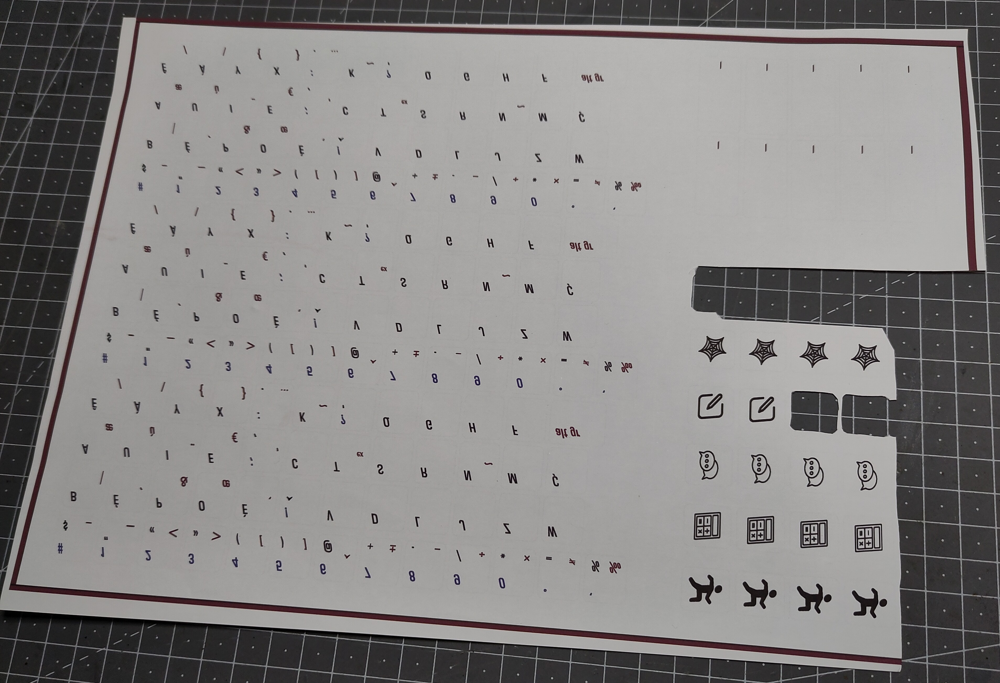
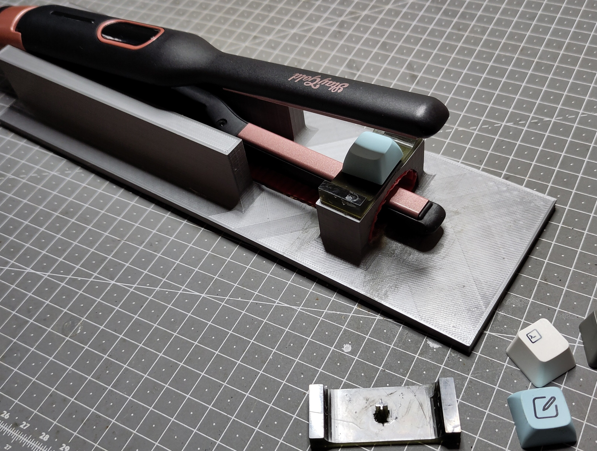
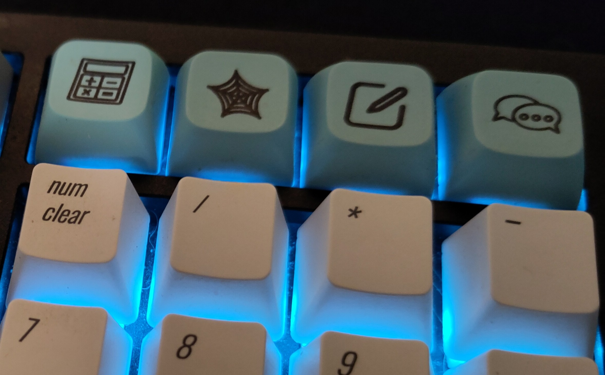

Il existe aussi une méthode à la graveuse laser, personnellement le rendu était affreux de mon côté, je vous recommande de tenter ça avec des graveuses de haute précision.

N'hésitez pas à chercher [des vidéos sur ce sujet](https://www.youtube.com/watch?v=8NTH36BTq4Y&list=PLDAnRch_iwbGM9jQVQaib-y4iswCPqIIr), c'est très instructif. Prévoyez bien sur quelques échecs, le temps de maîtriser les gestes.

# Conclusion ☕

Vous avez toutes les armes en main pour vous équiper du meilleur clavier imaginable. Ce petit bijou vous accompagnera probablement quotidiennement et pour toute la vie, entretenez-le, huiler les switchs et faite un nettoyage à l'alcool IPA de temps en temps.

Et pour ceux qui en veulent toujours plus, je vous redirige vers  [l'article de mon Sensei qui joue avec des Macropad](https://xieme-art.org/post/jouer-avec-le-macropad-adafruit-mais-en-serie).