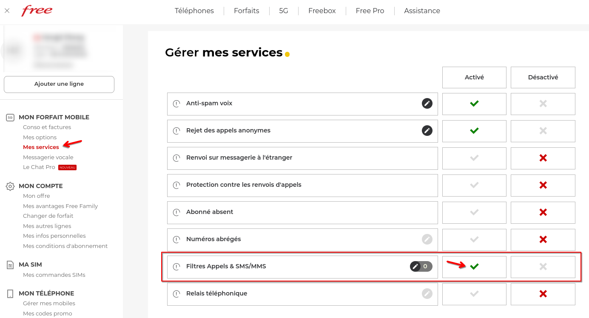
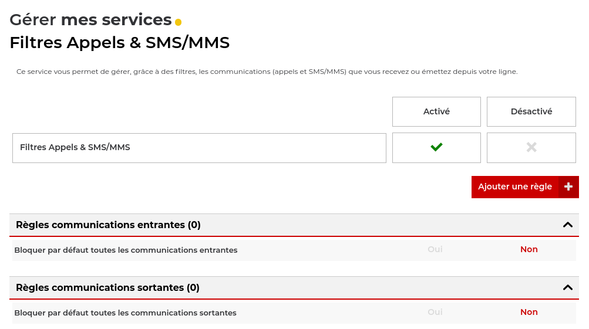
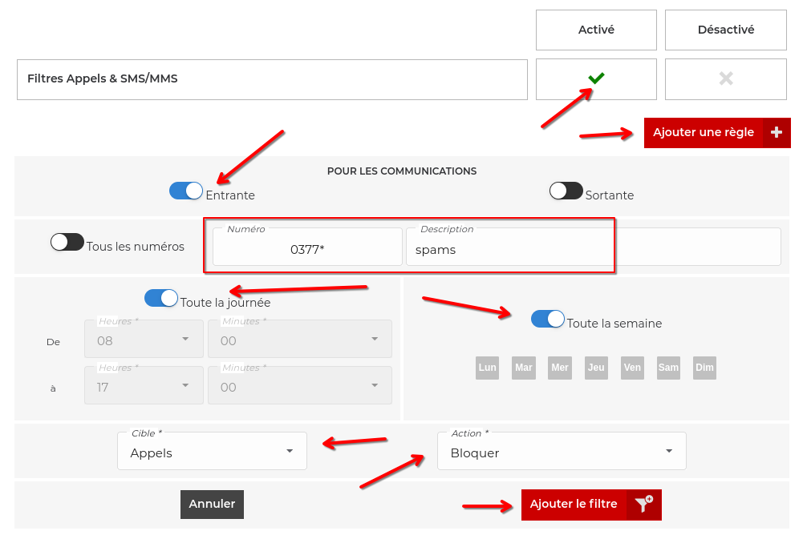
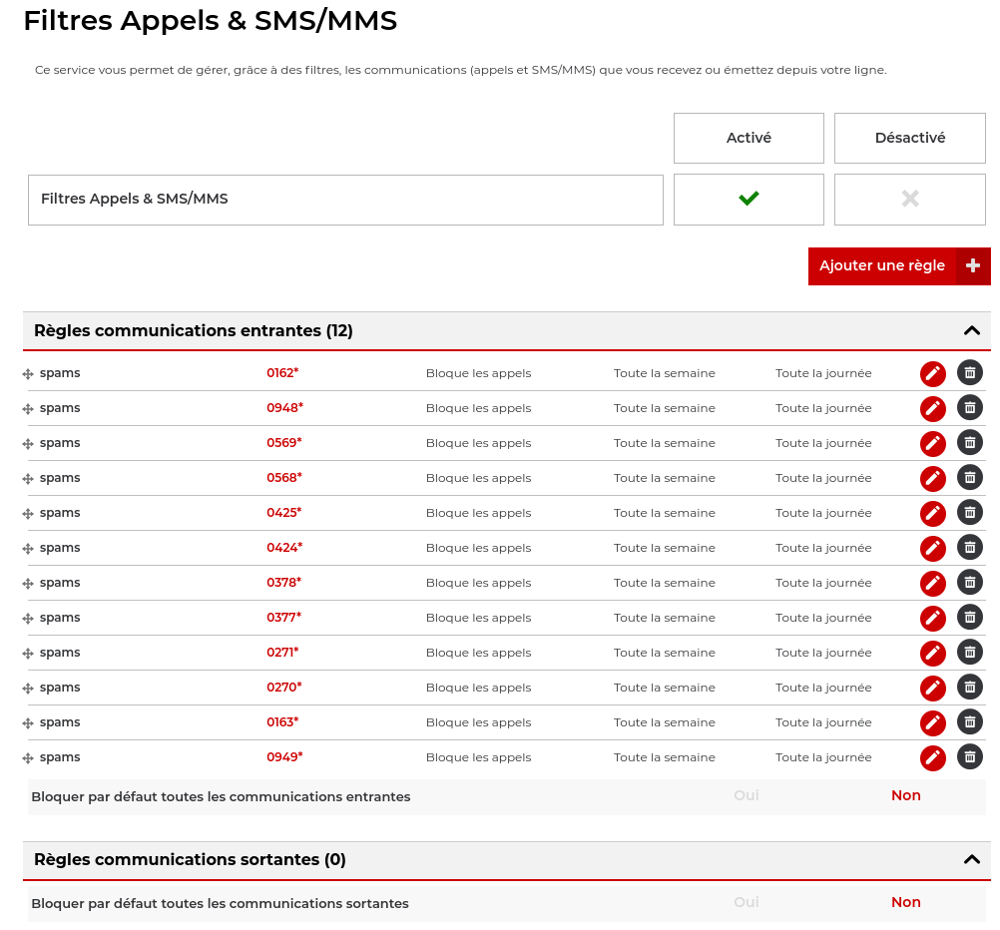

Title: En finir avec le démarchage téléphonique
Category: Astuce
Tags: telephonie, free, astuce, communication, smartphone, vieprivée
Date: 2025-05-05
Status: published

Vous êtes en plein flow dans votre travail, en pleine sieste dominicale, en dîner avec belle maman qui vous apprend la vie ou même simplement en train de vous connecter avec la nature sur votre trône de porcelaine en diminuant votre intellect sur un jeu casu, ... dring dring, un appel, vous décrochez par automatisme et vous vous retrouvez à expliquer à une pauvre nénette, que vous ne souhaitez pas acquérir ses joints d'étanchéité pour conduits d'évacuation de climatiseur de morgue de la marque Alphonse Robichu. Tiraillée entre l'envie de l'insulter et votre bonne conscience qui sait pertinemment qu'elle déteste son horrible job alimentaire.

# En finir pour de bon 😤

L'objet de cet article est de simplement vous partager une astuce très simple que j'ai trouvée pour vous permettre de lutter radicalement contre les centres d'appels, en 10 minutes chrono !
Il faut comprendre que ces centres d'appels légaux enchaînent les appels automatiques avec une liste exhaustive de numéro valide composés à la volée ou à l'aveugle, ce qui permet de contourner les restrictions des listes d'opposition. C'est pour cette raison que même inscrit sur Bloctel, vous continuerez de recevoir des appels.

Comment savent-ils que votre numéro est valide ? Très simple, vous avez répondu à un robot, via un ping call, un appel silencieux, un wangiri, ou vous avez simplement saisi votre numéro de téléphone sur un site douteux, les techniques ne manquent pas.

La stratégie n'est pas d'indiquer que vous ne souhaitez pas être contacté via une liste d'opposition aussi efficace que le "stop pub" sur votre boîte aux lettres ... mais plutôt d'effectuer une manipulation technique sur votre ligne téléphonique qui bloque ces appels, sans passer par votre téléphone ou une application foireuse.

# Les règles du jeu qui rendent cela possible ⚖️
[Le plan de numérotation adopté par l’ARCEP](https://www.arcep.fr/mes-demarches-et-services/entreprises/fiches-pratiques/plan-numerotation-professionnels.html) applicable dès 2023 a pour objectif notamment de renforcer la protection des utilisateurs contre les fraudes et abus. Ce dernier oblige depuis les centres d'appels qui respectent la lois à exploiter des **NVP** (numéros polyvalents vérifiés), autrement, ils prennent chère. Concrétement, cela les obliges à utiliser une plage de numéros avec les 12 racines communes suivante :

* 01 62
* 01 63
* 02 70
* 02 71
* 03 77
* 03 78
* 04 24
* 04 25
* 05 68
* 05 69
* 09 48
* 09 49

Leurs conditions d’utilisation prévoient que l’opérateur qui exploite ces numéros doit assurer à la personne appelée que l’affichage du numéro a bien fait l’objet d’une autorisation explicite de titulaire de ce numéro. Cela donne la possibilité d’identifier lors d’une enquête de manière plus fiable l’auteur d’une éventuelle infraction.

Cette disposition est un coup fort de l'ARCEP qui change tout pour nous ! Il "suffit" de ne plus jamais répondre à ces numéros "NVP" donc.

# Exploitons ce cadeau 🎁
Je vous montre une astuce avec Free Mobile, mais vous pouvez tenter d'effectuer une manipulation équivalente chez un autre opérateur (en espérant qu'il propose un mécanisme similaire). En-tout-cas, il suffit de savoir que ça existe pour que ça nous améliore la vie !

## S'authentifier sur le portail client
Sur [https://mobile.free.fr](https://mobile.free.fr), il faut repérer "Mes services", puis activer le service **"[Filtres Appels & SMS/MMS](https://mobile.free.fr/account/mes-services/filtres)"**. C’est ici que tout se joue.

## Créer des règles
Une fois activé, ajouter une nouvelle règle.

La nouvelle règle doit utiliser les paramètres suivants :

1. Communications : Entrante
2. Numéro : ``0162*``
3. Filtrage : Permanant (24/7)
4. Cible : Zppels
5. Action : **Bloquer**

L'énorme atout ici, est qu'il est possible d'utiliser le *wildcard* joker, soit l'*étoile* qui brille de mille feux et permet de remplacer tout chiffre !

Ainsi, en saisissant la syntaxe ``0162*``, c'est un filtre sur l'integralité des numéros commençant par **0162** qui est appliqué, radical !

Vous avez compris, il nous suffit donc de créer 12 filtres avec cette syntaxe pour bloquer tous les NVP. Cela donne quelque chose comme ceci :

Et nous voici enfin en paix, pour de bons ! 🤗

De rien 😙