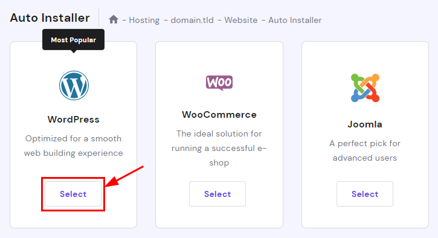
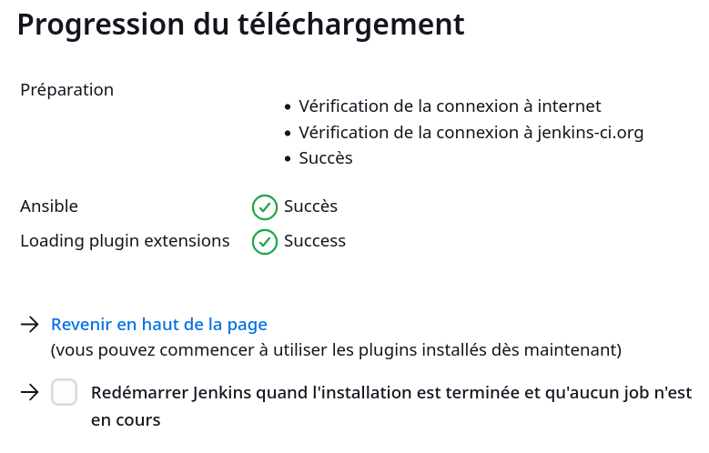
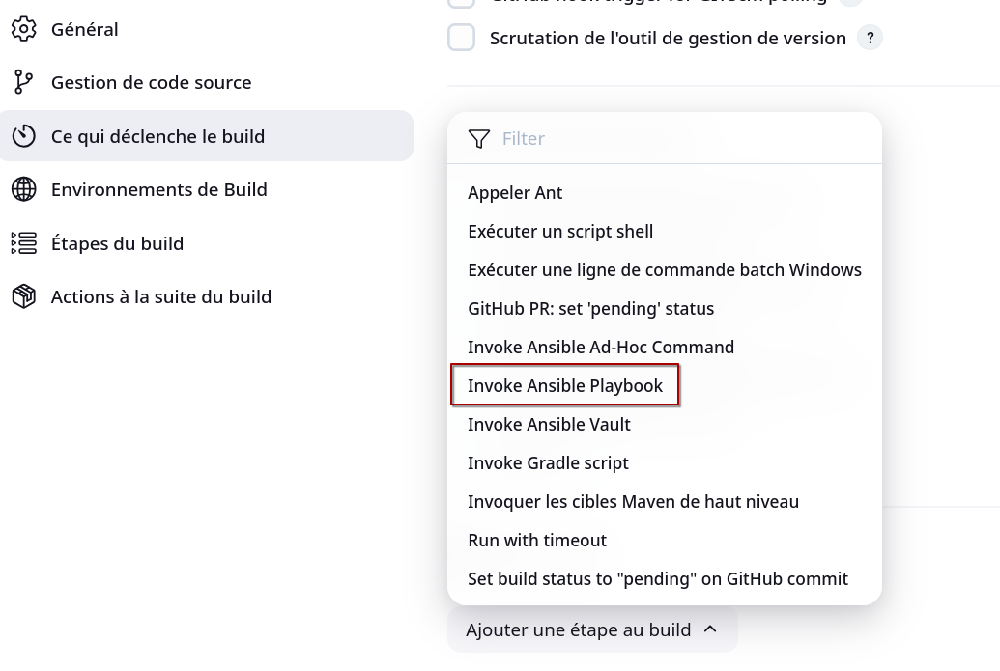

Title: Déployer vos instances WordPress en un clic
Category: Informatique
Tags: autohébergement, web, docker, wordpress, ansible, jenkins
Date: 2025-03-18
Status: published

Voyons comment mettre en place un workflow de déploiement de site WordPress via Jenkins, Ansible et Docker.

Cela permet de concevoir un pipeline CI/CD qui transforme un processus manuel lourd en un déploiement en un clic. Finalement à la manière des hébergeurs qui propose de l'installation automatique.



*Exemple de déploiement automatique chez Hostinger*

> Nous n'aborderons pas la partie réseau dans cet article, mais un reverse-proxy fournissant des certificats SSL est bien entendu recommandé.

Concernant le choix des outils :

* Jenkins est utilisé pour le déclenchement automatisé.

* Ansible pour la CaC, le playbooks executé par Jenkins exploite un rôle conçu pour l'occasion.

* Docker fournira trois conteneurs nécessaires par instance : wordpress, phpmyadmin et sftp.

Bien entendu, il est possible de remplacer Jenkins par n'importe quel outil d'orchestration capable d'éxecuter notre playbook Ansible 😉 Ici je pars du principe que vous avez déjà à disposition un nœud Jenkins prêt, pour commencer, il faut installer le [plugin Ansible](https://plugins.jenkins.io/ansible).



Vous aurez ainsi la possibilité de créer un Job avec des paramètres personalisés.



Dans le cadre de ce projet, voici les variables d'environnement personnalisables via jenkins :

```yaml
* docker_name: name of your container
* email_from: Email sender
* email_to: Email receiver
* email_host: SMTP server
* email_port: SMTP server port
* wp_image: Wordpress image on Docker Hub
* wp_port: Wordpress access port
* url: FQDN of Wordpress
* db_host: FQDN of DB server
* db_user: DB user
* db_pass: DB user password
* db_name: DB name
* pma_image: phpMyAdmin image on Docker Hub
* pma_port: phpMyAdmin access port
* sftp_image: SFTP image on Docker Hub
* sftp_port: SFTP access port
* sftp_user: SFTP user
* sftp_pass: SFTP user password
```

En effet, ce projet ne se contente pas de déployer un Wordpress "vanilla", il est configuré avec un nom de domaine, un serveur mail, une connexion à une base de données mysql ou mariadb, un SGBDR (phpMyAdmin) et finalement un service SFTP. Ainsi, le client bénéficie de tous ces outils isolés et dédiés pour son instance Wordpress lui permettant d'en avoir le contrôle complet.

Enfin, le serveur hôte doit pouvoir faire tourner (en plus de Docker) : Tar, MysqlDump et Crontab pour assurer des sauvegardes hebdomadaires automatique qui seront accessibles par le client sous forme d'archive dans un dossier "backups".

# Variables d'environnement par défaut

Dans votre rôle Ansible *docker_wordpress/defaults/main.yml*, initialiser les variables d'environnement par defaut :

```yaml
---
# Default Docker configuration
wpdocker_name: wordpress
wpdocker_root_dir: /opt

# Default Wordpress configuration
wpdocker_wp_image: wordpress:php8.1-apache
wpdocker_wp_port: 8000
wpdocker_url: wordpress.org

# SMTP plugin for Wordpress
wpdocker_plugin_smtp: post-smtp.2.1.10
wpdocker_plugin_smtp_sha1: ccd00333ef0f164510c78513a94c71b0d9875922

# Default phpMyAdmin configuration
wpdocker_pma_image: phpmyadmin:latest
wpdocker_pma_port: 9000

# Default SMTP configuration
wpdocker_email_host: localhost
wpdocker_email_port: 25

# Default SFTP configuration
wpdocker_sftp_image: atmoz/sftp:latest
wpdocker_sftp_port: 10000

```

Vous constaterez ici que le rôle Ansible déploie également un plugin Wordpress automatiquement.
J'utilise ici [Post SMTP](https://wordpress.org/plugins/post-smtp/) qui est le plugin le plus basique que j'ai trouvé pour l'envoi de mail via Wordpress.

Attention, ce plugin doit bien entendu être configuré une fois l'instance Wordpress prête, mais c'est très simple et rapide 👌

Si vous souhaitez utiliser une version plus récente du plugin, pensez à actualiser aussi son empreinte SHA1.

# Les templates Ansible

3 templates Jinja sont utilisés par le rôle :

Le template d'email (*welcome.j2*) envoyé automatiquement à la fin du déploiement :

```yaml
Bonjour,
Votre site Wordpress sur notre plateforme d’hébergement web est prêt !
Nous allons reprendre contact avec vous afin de vous communiquer vos mots de passe.
Voici les accès :
  - Site Wordpress : https://{{ item.url }}/
  - Configuration du Wordpress : https://{{ item.url }}/wp-admin/


HÉBERGEMENT
L'accès à l'espace d'hébergement s'effectue par le protocole SFTP.
Il est possible, par exemple, de s'authentifier avec le logiciel WinSCP (sur Windows) : https://winscp.net

Paramètres de connexion :
  - Serveur : {{ item.url }}
  - Port : {{ item.sftp_port }}

L'arborescence des fichiers comprend :

  - www/html : ce répertoire est celui exposé sur le web. C'est ici que Wordpress est installé.
  - backups : ce répertoire contient des sauvegardes hebdomadaires créées automatiquement.
  - custom.ini : votre configuration de PHP personalisée.


BASE DE DONNÉE
Votre Wordpress utilise également une base de données mises à votre disposition.
Il vous est possible d'utiliser votre propre base de données si besoin.

Paramètres de connexion :
  Nom de la DB : "{{ item.db_name }}"
  Accès : https://db.{{ item.url }}


CERTIFICAT SSL
Un certificat SSL est fourni et automatiquement renouvelé de façon régulière.
Tous les accès se font avec le protocole sécurisé HTTPS.


Nous restons à votre disposition pour tout complément d'information,
```

> Notez ici que l'url pour l'accès au SGBDR est systèmatiquement fixé avec un sous-domaine https://db.domain.tld

Un template pour Docker-Compose (*docker-compose.yml.j2*) :

```yaml
version: '3.1'
services:
  wordpress-fpm:
    image: "{{ item.wp_image }}"
    restart: unless-stopped
    container_name: "wp_{{ item.docker_name }}"
    ports:
      - {{ item.wp_port}}:80
    environment:
      WORDPRESS_DB_HOST: "{{ item.db_host }}"
      WORDPRESS_DB_USER: "{{ item.db_user }}"
      WORDPRESS_DB_PASSWORD: "{{ item.db_pass }}"
      WORDPRESS_DB_NAME: "{{ item.db_name }}"
    volumes:
      - {{ wpdocker_root_dir }}/{{ item.docker_name }}/data/www/html/:/var/www/html/ # Wordpress files
      - {{ wpdocker_root_dir }}/{{ item.docker_name }}/data/custom.ini:/usr/local/etc/php/conf.d/custom.ini # Custom PHP configuration

  phpmyadmin:
    image: "{{ item.pma_image }}"
    restart: unless-stopped
    container_name: "pma_{{ item.docker_name }}"
    ports:
      - {{ item.pma_port}}:80
    environment:
      PMA_ARBITRARY: 0
      PMA_HOST: "{{ item.db_host }}"
      PMA_ABSOLUTE_URI: "https://db.{{ item.url }}/"

  sftp:
    image: "{{ item.sftp_image }}"
    restart: unless-stopped
    container_name: "sftp_{{ item.docker_name }}"
    ports:
      - {{ item.sftp_port}}:22
    command: "{{ item.sftp_user }}:{{ item.sftp_pass }}:33"
    volumes:
      - {{ wpdocker_root_dir }}/{{ item.docker_name }}/data/:/home/{{ item.sftp_user }}/ # DATA files
```

> L'accès au fichier *custom.ini* est judicieux pour permettre au client d'avoir un maximum de l'attitude sur la configuration de son instance Wordpress, mais cela reste facultatif.

> Ici, le service SFTP utilise un volume limité au repertoire "data" exclusivement.

Finalement, un template pour les sauvegardes quotidienne (*backups.sh.j2*) :

```bash
#!/bin/sh
# Backups Wordpress {{ item.docker_name }}

# Prune old Backups
find /opt/{{ item.docker_name }}/data/backups/* -mtime +90 -type f -exec rm -f {} \;

# DB
mysqldump -h {{ item.db_host }} -u sqladmin -p{{ vault_wh_sqladmin_mysql_pass }} -e -c --databases {{ item.db_user }} > /opt/{{ item.docker_name }}/data/backups/db-{{ item.db_user }}-$(date +%Y-%m-%d-%H.%M.%S).sql

# Wordpress
tar -czf /opt/{{ item.docker_name }}/data/backups/www-{{ item.db_user }}-$(date +%Y-%m-%d-%H.%M.%S).zip /opt/{{ item.docker_name }}/data/www/

# Apply permissions
chown -R 33:33 /opt/{{ item.docker_name }}/data/backups/
```

> Ici, les sauvegardes de plus de 3 mois sont prunés avec un méthode très brutale avant de déclencher les backups. Ansi, assurez-vous que le fuseau horraire de votre serveur est correctement configuré ! ⏱️

> L'application des permissions est a adapter en fonction de votre serveur, dans mon cas ici, c'est L'UID 33.

# Tâches du rôle ansible

Dans votre rôle Ansible *docker_wordpress/tasks/tree.yml*, initialiser l'arboressence des fichier nécessaire de l'instance :

```yaml
- name: Create BIN directory for customers
  with_items: "{{ wpdockers }}"
  file:
    path: "{{ wpdocker_root_dir }}/{{ item.docker_name }}/bin"
    state: directory
    owner: root
    group: root
    mode: '0644'

- name: Create DATA directory for customers
  with_items: "{{ wpdockers }}"
  file:
    path: "{{ wpdocker_root_dir }}/{{ item.docker_name }}/data"
    state: directory
    owner: 33
    group: 33
    mode: '0770'

- name: Create BACKUPS directory for customers
  with_items: "{{ wpdockers }}"
  file:
    path: "{{ wpdocker_root_dir }}/{{ item.docker_name }}/data/backups"
    state: directory
    owner: 33
    group: 33
    mode: '0770'

- name: Create ETC directory for customers
  with_items: "{{ wpdockers }}"
  file:
    path: "{{ wpdocker_root_dir }}/{{ item.docker_name }}/etc"
    state: directory
    owner: root
    group: root
    mode: '0644'

```

> Séparer la création de l'arborescence de la tâche principale permet de rendre plus clairs le code et la maintenance de notre rôle.

Dans votre rôle ansible *docker_wordpress/tasks/main.yml*, initialiser la tâche principale :

```yaml
---

- include: tree.yml

- name: Deploy docker-compose YML file
  with_items: "{{ wpdockers }}"
  template:
    src: docker-compose.yml.j2
    dest: "{{ wpdocker_root_dir }}/{{ item.docker_name }}/etc/docker-compose.yml"
    owner: root
    group: root
    mode: '0644'

- name: Deploy mariadb-backup
  dnf:
    name: mariadb-backup
    state: present

- name: Deploy backups script
  with_items: "{{ wpdockers }}"
  template:
    src: backups.sh.j2
    dest: "{{ wpdocker_root_dir }}/{{ item.docker_name }}/bin/backups.sh"
    owner: root
    group: root
    mode: '0700'

- name: Setup cron job to backup Wordpress
  with_items: "{{ wpdockers }}"
  cron:
    name: "Backups for {{ item.docker_name }} each Sunday at midnight"
    weekday: "0"
    hour: "0"
    minute: "0"
    job: "/bin/bash {{ wpdocker_root_dir }}/{{ item.docker_name }}/bin/backups.sh"

- name: Deploy custom PHP config file
  with_items: "{{ wpdockers }}"
  file:
    path: "{{ wpdocker_root_dir }}/{{ item.docker_name }}/data/custom.ini"
    state: touch
    owner: 33
    group: 33
    mode: '0770'

- name: Restart Docker
  service: name=docker state=restarted

- name: Down containers
  with_items: "{{ wpdockers }}"
  command: "docker-compose -f {{ wpdocker_root_dir }}/{{ item.docker_name }}/etc/docker-compose.yml -p {{ item.docker_name }} down"

- name: Launch containers
  with_items: "{{ wpdockers }}"
  command: "docker-compose -f {{ wpdocker_root_dir }}/{{ item.docker_name }}/etc/docker-compose.yml -p {{ item.docker_name }} up -d"

- name: Create TMP folder for plugin archive
  with_items: "{{ wpdockers }}"
  file:
    path: "{{ wpdocker_root_dir }}/{{ item.docker_name }}/data/www/html/wp-content/plugins/tmp"
    state: directory

- name: Get SMTP plugin for Wordpress
  with_items: "{{ wpdockers }}"
  get_url:
    url: "https://downloads.wordpress.org/plugin/{{ wpdocker_plugin_smtp }}.zip"
    dest: "{{ wpdocker_root_dir }}/{{ item.docker_name }}/data/www/html/wp-content/plugins/tmp"
    checksum: "sha1:{{ wpdocker_plugin_smtp_sha1 }}"

- name: Extract SMTP plugin archive
  with_items: "{{ wpdockers }}"
  unarchive:
    src: "{{ wpdocker_root_dir }}/{{ item.docker_name }}/data/www/html/wp-content/plugins/tmp/{{ wpdocker_plugin_smtp }}.zip"
    dest: "{{ wpdocker_root_dir }}/{{ item.docker_name }}/data/www/html/wp-content/plugins/"
    owner: 33
    group: 33
    mode: '0755'
    remote_src: yes

- name: Remove TMP folders for wordpress plugins
  with_items: "{{ wpdockers }}"
  file:
    path: "{{ wpdocker_root_dir }}/{{ item.docker_name }}/data/www/html/wp-content/plugins/tmp"
    state: absent

- name: Send emails with summary config
  with_items: "{{ wpdockers }}"
  mail:
    host: "{{ item.email_host }}"
    port: "{{ item.email_port }}"
    from: "{{ item.email_from }}"
    to: "{{ item.email_to }}"
    subject: "Votre nouvelle instance de Wordpress est prête : {{ item.url }}"
    body: "{{ lookup('template', 'templates/welcome.j2') }}"

```

> Ici, fonctionne sur un environnement CentOS. Adaptez cette tâche à votre OS.

``wpdocker_root_dir`` est utilisé pour configurer le chemin racine de votre docker.
Ainsi, chaque instance crée un dossier utilisant le nom de vos conteneurs (nom du projet). Dans ce dossier d'instance, vous pouvez trouver :

* **bin** : Script, like weekly backups.
* **data** : For access content for Webmaster (accès to Wordpress files, backups, php INI config file, ...)
* **etc** : For config files (like ``docker-compose.yml``)

Ici, les sauvegardes hebdomadaires lancées avec Crontab chaque dimanche à minuit.

# Variables d'hôtes

Voici à quoi pourrait ressembler votre inventaire d'hôtes **wpdockers** :

```yaml
---

# List of Websites
wpdockers:
  - name: Wordpress 01
    docker_name: wp01
    email_from: Heuzef <contact@heuzef.com>
    email_to:
    - Heuzef <contact@heuzef.com>
    email_host: localhost
    email_port: 25
    # Wordpress
    wp_image: "{{ wpdocker_wp_image }}"
    wp_port: 8000
    url: wp01.heuzef.com
    # DB
    db_host: db.heuzef.com
    db_user: heuzef
    db_pass: "{{ vault_heuzef_mariadb_pass.replace('$','$$') }}"
    db_name: heuzef
    # phpMyAdmin
    pma_image: "{{ wpdocker_pma_image }}"
    pma_port: 9000
    # SFTP
    sftp_image: "{{ wpdocker_sftp_image }}"
    sftp_port: 10000
    sftp_user: heuzef
    sftp_pass: "{{ vault_heuzef_sftp_pass.replace('$','$$') }}"

  - name: Wordpress 02
    docker_name: wp02
    email_from: Heuzef <contact@heuzef.com>
    email_to:
    - Heuzef <contact@heuzef.com>
    email_host: "{{ wpdocker_email_host }}"
    email_port: "{{ wpdocker_email_port }}"
    # Wordpress
    wp_image: "{{ wpdocker_wp_image }}"
    wp_port: 8001
    url: wp02.heuzef.com
    # DB
    db_host: db.heuzef.com
    db_user: heuzef
    db_pass: "{{ vault_heuzef_mariadb_pass.replace('$','$$') }}"
    db_name: heuzef
    # phpMyAdmin
    pma_image: "{{ wpdocker_pma_image }}"
    pma_port: 9001
    # SFTP
    sftp_image: "{{ wpdocker_sftp_image }}"
    sftp_port: 10001
    sftp_user: heuzef
    sftp_pass: "{{ vault_heuzef_sftp_pass.replace('$','$$') }}"

# Customs rules for rev-proxy
proxyin_ip: 0.0.0.0
wp_ports_range: 8000:8099
pma_ports_range: 9000:9099
sftp_ports_range: 10000:10099

iptables_custom_rules:
  - name: Allow Wordpress ports for rev-proxy
    rules: "-A INPUT -m state --state NEW -p tcp --dport {{ wp_ports_range }} -s {{ proxyin_ip }} -j ACCEPT"
    state: present
  - name: Allow phpMyAdmin ports for rev-proxy
    rules: "-A INPUT -m state --state NEW -p tcp --dport {{ pma_ports_range }} -s {{ proxyin_ip }} -j ACCEPT"
    state: present
  - name: Allow SFTP ports for rev-proxy
    rules: "-A INPUT -m state --state NEW -p tcp --dport {{ sftp_ports_range }} -s {{ proxyin_ip }} -j ACCEPT"
    state: present
```

# Configuration DNS :
Pour terminer, il faut bien sûr enregistrer les entrées DNS des noms de domaine utilisés par les instances déployés.

``@ 10800 IN A <your-reverse-proxy-ip>``

``db 10800 IN A <your-reverse-proxy-ip>``


Et voilà ✌️ Avec ceci, vous devriez avoir une très bonne base pour concevoir votre projet de déploiement Wordpress automatisé.


