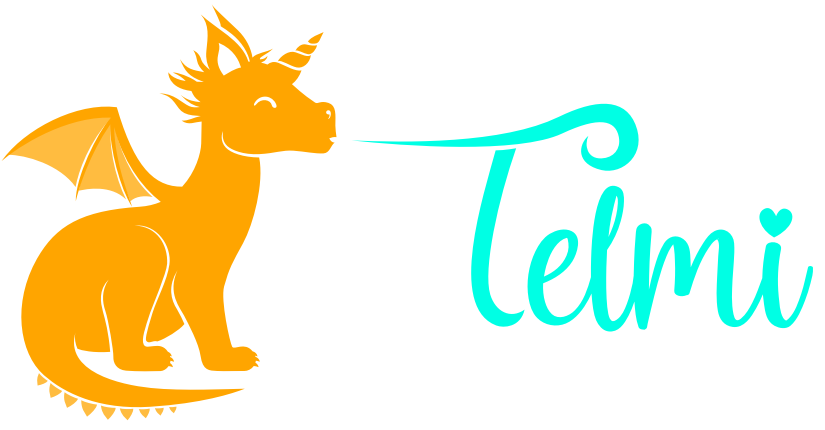
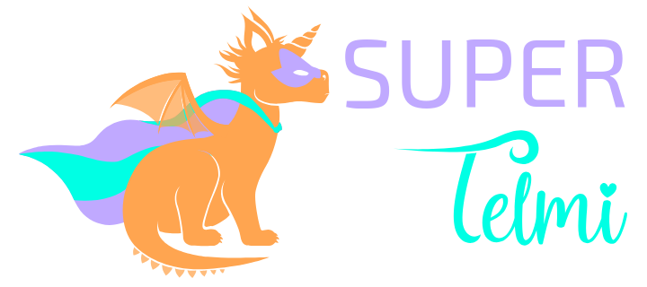

Title: Concevoir une boîte à histoires pour enfant
Category: Parentalité
Tags: enfant, astuce, ressources, histoire, 3D
Date: 2026-03-09
Status: published

Vous avez des enfants ? Salut ! 👋 Cet article va vous plaire, nous parlerons ici des boîtes à histoires (ou conteuses) qui intéressent de plus en plus les parents ces dernières années.

## C’est quoi, une boîte à histoires ? 🤔

Si vous ne connaissez pas, pour faire court, c'est une petite machine-jouet qui permet aux enfants d’écouter des histoires audio interactives, des musiques ou des podcasts **sans écran et en totale autonomie**.
C'est un peu la super arme du parent moderne. Les bénéfices sont très nombreux et c'est clairement un des cadeaux les plus intelligents et rentables à offrir à un enfant (stimule l'imagination, éducatif, pas de pubs, du contenu adapté, ...). Et les enfants adoooooorent ❤️‍🔥

> Pour l'explication détaillée, [Cultura a fait un super guide](https://www.cultura.com/les-guides-d-achat/guides-univers-enfant/quelle-conteuse-choisir.html) sur le sujet.

## Le combat des boîtes à histoires 🥊

Voici un petit tableau comparatif des conteuses les plus populaires pour y voir plus clair :

|       Marque      	| Complétement hors ligne 	| Création possible 	| Open-Source 	| Application Smartphone 	| Réparable 	| Prix achat 	| Coûts supplémentaires 	|
|:-----------------:	|:-----------------------:	|:-----------------:	|:-----------:	|:----------------------:	|:---------:	|:--------------------:	|:-----------------:	|
|      Bookinou     	|            ❌            	|         ✅         	|      ❌      	|            ✅           	|     ❌     	|           80€          	|         10€ - 13€/histoire         	|
|      Disney       	|            ✅            	|         ❌         	|      ❌      	|            ❌           	|     ❌     	|           35€          	|         15€/figurine        	|
|        Max        	|            ❌            	|         ✅         	|      ❌      	|            ✅           	|     ❌     	|           70€          	|         5€ - 15€/histoire         	|
|       Merlin      	|            ❌            	|         ✅         	|      ❌      	|            ✅           	|     ❌     	|           90€          	|         4€ - 23€/histoire         	|
|       Morphée         |            ✅            	|         ❌         	|      ❌      	|            ❌           	|     ❌     	|           80€          	|         0€         	|
|    Lunii / Flam   	|            ❌            	|         ✅         	|      ❌      	|            ✅           	|     ❌     	|           70€ - 100€         	|         13€ - 15€/histoire         	|
|      T'choupi     	|            ✅            	|         ❌         	|      ❌      	|            ❌           	|     ❌     	|           35€          	|         0€         	|
|       Telmi       	|            ✅            	|         ✅            |      ✅      	|            ✅           	|     ✅     	|           0€ - 100€          	|         0€         	|
|      Tikino       	|            ❌            	|         ❌              |      ❌      	|            ✅           	|     ❌     	|           170€          	|         3€ - 8€        	|
|      Toniebox     	|            ❌            	|         ✅         	|      ❌      	|            ✅           	|     ❌     	|           120€          	|         15€/figurine         	|
|        Yoto       	|            ❌            	|         ✅         	|      ❌      	|            ✅           	|     ❌     	|           70€ - 100€          	|         7€ - 35€/carte         	|

> Comme vous pouvez le constater rapidement, cet article a pour objectif de mettre **[Telmi](https://telmi.fr)** à l'honneur. Et ce n'est pas pour rien !

## Pourquoi Telmi les domine toutes ? 🌟

Pour faire simple **[Telmi](https://telmi.fr)** est imbattable sur tous les plans. Faire un comparatif avec les autres n'a pas de sens vu qu'elle est hors catégorie. Pour comprendre pourquoi, il faut essayer de connaître l'histoire de ce projet.

Telmi est une association à but non-lucratif, réunissant des milliers de parents bénévoles, passionnés et dévoués à leurs enfants.

À l'origine, le Français [DantSu](https://dantsu.com), qui en bon papa, a décidé de développer lui-même son propre système sur mesure pour ses enfants, afin de contrer les nombreuses frustrations provoquées par les boîtes à histoires sur le marché.

### 1️⃣ Libre
Contrairement aux autres boîtes à histoires qui vous enferment dans un écosystème payant et fermé, celui de **[Telmi](https://telmi.fr)** est libre. Cela signifie qu'il sera toujours gratuit et open-source. Vous pouvez le modifier, l’améliorer, le partager, etc ...

### 2️⃣ Hors-ligne
**[Telmi](https://telmi.fr)** dispose d'un fonctionnement totalement hors-ligne. Aucune exposition ni traçage possible.

### 3️⃣ Créativité
Le logiciel **Telmi-Sync** permet de :

- Gérer les histoires, les podcasts, les musiques (MP3, OGG, FLAC, …).
- Créer des histoires interactives complexes.
- Avoir accès sans limite aux créations des autres parents via les "Stores Telmi".

### 4️⃣ Communauté
Très forte et soudée, jugez vous-même en rejoignant le [Canal de discussion Discord](https://discord.gg/ZTA5FyERbg) ou en [rencontrant un membre près de chez vous](https://umap.openstreetmap.fr/fr/map/entraide-telmi_1342678).

### 5️⃣ Prix
L'application smartphone permet déjà un usage complet et gratuit de **[Telmi](https://telmi.fr)**. Idéal si vous avez un vieux téléphone ou une tablette qui peut être dédiée à votre enfant ♻️

Mais d'ordinaire, **[Telmi](https://telmi.fr)** est conçue pour fonctionner sur une **Miyoo Mini Plus** avec une **carte SD**.
Quelques précieux conseils de la communauté sont disponibles sur le **[WIKI de Telmi](https://wiki.telmi.fr)** dans la rubrique "Achats".

### 6️⃣ Réparabilité

Le détournement de la **Miyoo Mini Plus** pour la convertir en boîte à histoires est un coup de génie. En effet, cette petite console chinoise est déjà très populaire dans l'univers des rétro-gamers qui se sont empressés de bidouiller dans tous les sens ce petit appareil abordable.
En cas de problème, il devient facile de récupérer des pièces de rechange et d'obtenir de l'aide pour la réparer.

## Fonctionnement 🛠️

Venons-en au point qui fâche. Si certains boudent **[Telmi](https://telmi.fr)**, c'est simplement parce que pour en bénéficier, il va falloir vous remonter les manches et y consacrer un peu de temps et d'énergie (bouuuuh ! 🍅)

Évidemment, acheter un produit tout prêt, ça ne vous demandera qu'un simple achat en magasin puis une petite après-midi tranquille pour maîtriser le machin. Avec **[Telmi](https://telmi.fr)**, ça ne va clairement pas être la même sauce, car vous avez ici la mission de comprendre le processus. Mais après tout, qu'est-ce qu'on ne serait pas prêt à faire pour offrir le meilleur à nos enfants ?! Et franchement, rassurez-vous, c'est vraiment accessible :

- Si vous savez utiliser un ordinateur, vous en êtes capable.
- Si vous êtes plutôt à l'aise avec la technologie, ça sera tranquille et la création d'histoires ne vous fera pas peur.
- Si vous êtes un geek, alors là, vous allez vous amuser comme un petit fou.
- Si vous êtes un gamer ... oui, vous pouvez utiliser [OnionOS](https://onionui.github.io) en parallèle en douce héhéhé 🎮

Voici les étapes à suivre pour vous lancer dans l'aventure :

* **[Se documenter](https://telmi.fr/documentation.html)**
* Réunir le matériel (Android ou Mini Miyoo Mini Plus, carte SD et un ordinateur)
* Installer et prendre en main Telmi-Sync sur votre ordinateur
* Déployer TelmiOS sur une carte SD
* Synchroniser ses premières histoires et musiques
* [Rejoindre la communauté](https://discord.gg/ZTA5FyERbg) et créer ses propres histoires interactives

Et du côté de l'enfant ? Ma fille de 3 ans a réussi à maîtriser la machine en 1h, toute seule ... Que ça nous serve de leçon 😼

## La SUPER TELMI ! 🦸

Si Telmi est déjà la meilleure boîte à histoires du marché, la **[SUPER TELMI](https://github.com/heuzef/super-telmi)**, c’est la version boostée aux hormones. 

Projet initié et maintenu par Heuzef (coucou, c'est moi), son objectif est de réunir les différentes améliorations de la communauté.

Nous y avons intégré un **haut-parleur haute qualité** pour un son clair et puissant. Plus besoin de casque (même si c’est toujours possible). Avec en option, une **station d'accueil** très confortable pour la recharge quotidienne.

Le design est cool et ultra-robuste. Elle est protégée par une **coque renforcée**, résistante aux chocs et aux petites mains colériques. Parce qu’on sait comment les enfants traitent leurs jouets …

Imaginée, testée et approuvée par des parents et des enfants au quotidien. Chaque amélioration vient de retours concrets. Tout est pensé pour répondre aux vrais besoins des familles.

Si vous êtes suffisamment compétent en électronique et impression 3D, les plans sont open-source, **[fabriquez-la !](https://github.com/heuzef/super-telmi)**

<video id="super_telmi" controls preload="auto" width="900" height="500">
<source src="../../assets/super-telmi.mp4" type='video/mp4'>
</video>

*PS : Si vous avez des questions, des idées, ou juste envie de partager votre expérience, envoyez-moi un message ! Je suis toujours ravi d’échanger avec d’autres parents.* 🍼
