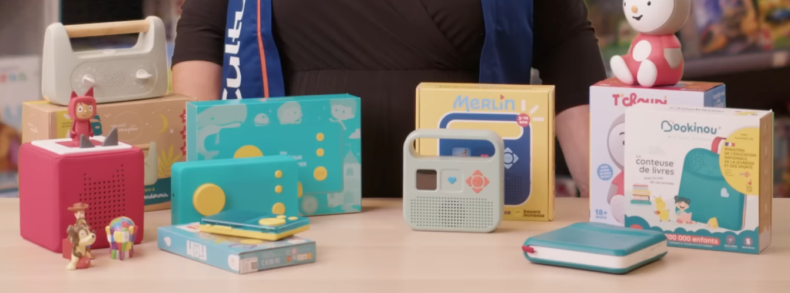
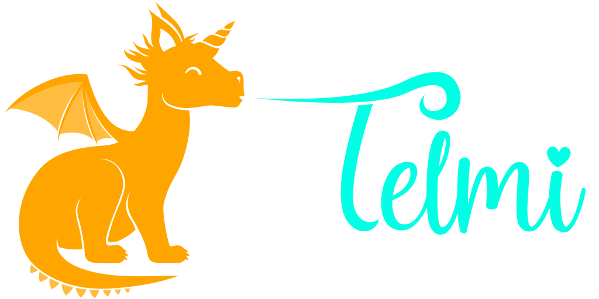
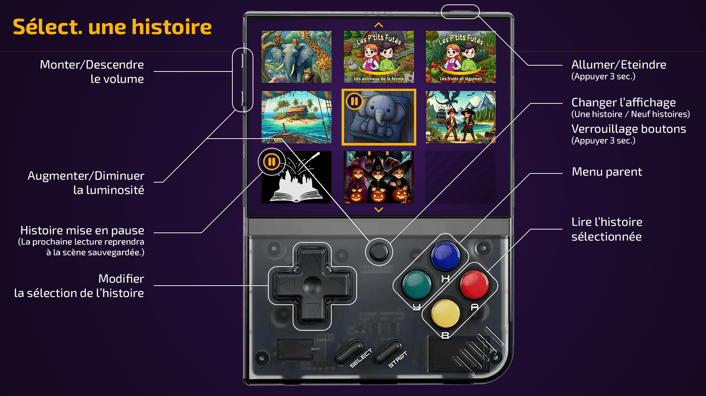

Title: Concevoir une boîte à histoires pour enfant
Category: Parentalité
Tags: enfant, astuce, ressources, histoire
Date: 2026-03-09
Status: draft

Vous avez des enfants ? Salut ! 👋 Cette article va vous plaire, nous parlerons ici des boîtes à histoire (ou conteuse) qui interesse de plus en plus les parents ces dernières années.

## C’est quoi, une boîte à histoires ? 🤔

Si vous ne connaissez pas, pour faire court, c'est une petite machine-jouet qui permet aux enfants d’écouter des histoires audio interactives, des musiques ou des podcasts **sans écran**, **sans ondes** et **en totale autonomie**.
C'est un peu la super arme du parent moderne, les bénéfices sont très nombreux et c'est clairement un des cadeaux les plus intelligent et rentable à offrir à un enfant (stimule l'imagination, educatif, pas de pubs, du contenu adapté, ...). Et les enfants adoooooorent ❤️‍🔥

> Pour l'explication détaillée, [Cultura a fait un super guide](https://www.cultura.com/les-guides-d-achat/guides-univers-enfant/quelle-conteuse-choisir.html) sur le sujet.

## Le combat des boîtes à histoires 🥊

Voici un petit tableau comparatif des conteuse les pus populaires pour y voir plus clair :

|       Marque      	| Complétement hors ligne 	| Création possible 	| Open-Source 	| Application Smartphone 	| Réparable 	| Prix achat 	| Coûts supplémentaires 	|
|:-----------------:	|:-----------------------:	|:-----------------:	|:-----------:	|:----------------------:	|:---------:	|:--------------------:	|:-----------------:	|
|      Bookinou     	|            ❌            	|         ✅         	|      ❌      	|            ✅           	|     ❌     	|           80€          	|         10€ - 13€/histoire         	|
|      Disney       	|            ✅            	|         ❌         	|      ❌      	|            ❌           	|     ❌     	|           35€          	|         15€/figurine        	|
|        Max        	|            ❌            	|         ✅         	|      ❌      	|            ✅           	|     ❌     	|           70€          	|         5€ - 15€/histoire         	|
|       Merlin      	|            ❌            	|         ✅         	|      ❌      	|            ✅           	|     ❌     	|           90€          	|         4€ - 23€/histoire         	|
|       Morphée         |            ✅            	|         ❌         	|      ❌      	|            ❌           	|     ❌     	|           80€          	|         0€         	|
|    Lunii / Flam   	|            ❌            	|         ✅         	|      ❌      	|            ✅           	|     ❌     	|           70€ - 100€         	|         10€/mois (Lunii+)         	|
|      T'choupi     	|            ✅            	|         ❌         	|      ❌      	|            ❌           	|     ❌     	|           35€          	|         0€         	|
|       Telmi       	|            ✅            	|         ✅            |      ✅      	|            ✅           	|     ✅     	|           0€ - 100€          	|         0€         	|
|      Tikino       	|            ❌            	|         ❌              |      ❌      	|            ✅           	|     ❌     	|           170€          	|         3€ - 8€        	|
|      Toniebox     	|            ❌            	|         ✅         	|      ❌      	|            ✅           	|     ❌     	|           120€          	|         15€/figurine         	|
|        Yoto       	|            ❌            	|         ✅         	|      ❌      	|            ✅           	|     ❌     	|           70€ - 100€          	|         7€ - 35€/carte         	|

> Comme vous pouvez le constater rapidement, cet article met clairement **[Telmi](https://telmi.fr)** à l'honneur.

## 🌟 Pourquoi Telmi les domines tous ?

Pour faire simple, **[Telmi](https://telmi.fr)** sera imbatable, sur tous les plans, pour toujours et à jamais. Faire un comparatifs avec les autres n'a aucun sens vu qu'il est hors catagorie. Pour comprendre tout cela, il faut essayer de comprendre l'histoire de cette commaunautée.

Telmi est une association à but non lucratif, réunissant des milliers de parents bénévoles passionnés et dévoués pour leur enfants.

À l'origine de ce projet, le Français [DantSu](https://dantsu.com), qui, en bon papa, a décidé de developper son propre système sur mesure lui-meme pour ses enfants afin de contrer les nombreuses frustrations offertes par les boîtes à histoire sur le marché.

### 1️⃣ Libre
Contrairement aux autres boîtes à histoires qui vous enferment dans un écosystème payant et fermé, **[Telmi](https://telmi.fr)** est libre. Cela signifie qu'il sera toujours gratuit et open-source, vous pouvez le modifier, l’améliorer, le partager, etc ...

### 2️⃣ Hors-Ligne
**[Telmi](https://telmi.fr)** dispose d'un fonctionne totalement hors-ligne. Aucune exposition ni traçage possible.

### 3️⃣ Créativité
Le logiciel **Telmi-Sync** permet de :

- Gérer les histoires, les podcasts, les musiques (MP3, OGG, FLAC, …).
- Créer des histoires interactives complexe.
- Avoir accès sans limite aux créations des autres parents via les "Stores Telmi".

### 4️⃣ Communauté
Très forte et soudée, jugez par vous-meme en rejoignant le [Canal de discution Discord](https://discord.gg/ZTA5FyERbg) ou en [rencontrant un membre prêt de chez vous](https://umap.openstreetmap.fr/fr/map/entraide-telmi_1342678).

### 5️⃣ Prix
L'application smartphone, permet déjà un usage complet et gratuit de **[Telmi](https://telmi.fr)**. Idéal si vous avez un vieux téléphone ou tablette qui peut être dédié à votre enfant.

Mais d'ordinaire, **[Telmi](https://telmi.fr)** est conçu pour fonctionner sur une **Miyoo Mini Plus** avec une **carte SD**.
Quelques précieux conseil de la communauté sont disponible sur le **[WIKI de Telmi](https://wiki.telmi.fr)** dans la rubrique "Achats".

### 6️⃣ Réparabilité

Le détournement de la **Miyoo Mini Plus** pour la convertir en boîte à histoire est un coup de génie. En effet, cette petite console chinoise est déjà très populaire dans l'univers des retro-gamers qui se sont empressé de bidouiller dans tous les sens ce petit appareil abordable.
En cas de problème, il devient facile de récupérer des pièces de rechange et d'obtenir de l'aide pour la répareration.

## 🛠️ Fonctionnement

Venons-en au point qui fache, si certains boudent **[Telmi](https://telmi.fr)**, c'est simplement parceque pour en bénéficier, il va falloir vous remonter les manches et y consacrer du temps et de l'energie (bouuuuh ! 🍅)

Evidement, acheter un produit tout prêt, ça ne vous demandera qu'un simple achat en magasin puis une petite après-midi tranquille pour maitriser le machin. Avec **[Telmi](https://telmi.fr)**, ça ne va clairement pas être la meme sauce, car vous avez ici une véritiable mission de comprendre le processus. Mais après tout, qu'est-ce qu'on ne serait pas prêt à faire pour offrir le meilleur à nos enfants !

- Si vous savez utiliser un ordinateur, vous en ete capable.
- Si vous êtes plutot a l'aise avec la technologie, ca sera tranquille et la création d'histoire ne vous fera pas peur.
- Si vous êtes un geek, alors la, vous aller kiffer comme jamais.
- Si vous êtes un gamer ... oui, vous pouvez utiliser [OnionOS](https://onionui.github.io) en parrallèle en lousdé héhéhé 🎮

Voici les étapes à suivre pour vous lancer dans l'aventure :

* **[Vous documenter](https://telmi.fr/documentation.html)**
* Réunir le matériel (Android ou Mini Miyoo Mini Plus, carte SD et un ordinateur)
* Installer et prendre en main Telmi-Sync sur votre ordinateur
* Déployer TelmiOS sur une carte SD
* Syncroniser ses premières histoires et musique
* [Rejoindre la communauté](https://discord.gg/ZTA5FyERbg) et créer ses propres histoires interactives

Et du coté de l'enfant ? Ma fille de 3 ans a réussis à maitriser la machine en 1h, toute seule ... Que ça nous serve de leçon 😼

## 🦸 La SUPER TELMI ?

Si Telmi est déjà la meilleure boîte à histoires du marché, la **[SUPER TELMI](https://github.com/heuzef/super-telmi)**, c’est une version boosté aux hormones. 

Projet initié et maintenu par Heuzef (coucou, c'est moi), son objectif et de réunir les différentes améliorations de la communautée.

Nous y avons intégré un **haut-parleur haute qualité** pour un son clair et puissant. Plus besoin de casque (même si c’est toujours possible). Avec en option, une **station d'accueil** très confortable pour la rechage quotidienne.

Le design est cool et ultra-robuste, protégée par une **coque renforcée**, résistante aux chocs et aux petites mains colériques. Parce qu’on sait comment les enfants traitent leurs jouets …

Imaginée, testée et approuvée par des parents et des enfants au quotidien. Chaque amélioration vient de retours concrets. Tout est pensé pour répondre aux vrais besoins des familles.

Si vous êtes suffisament compétants en éléctronique et impression 3D, les plans sont open-source, **[fabriquez-la !](https://github.com/heuzef/super-telmi)**.

<video id="super_telmi" controls preload="auto" width="900" height="500">
<source src="../../assets/super-telmi.mp4" type='video/mp4'>
</video>

*PS : Si vous avez des questions, des idées, ou juste envie de partager votre expérience, envoyez-moi un message ! Je suis toujours ravi d’échanger avec d’autres parents.* 😊
